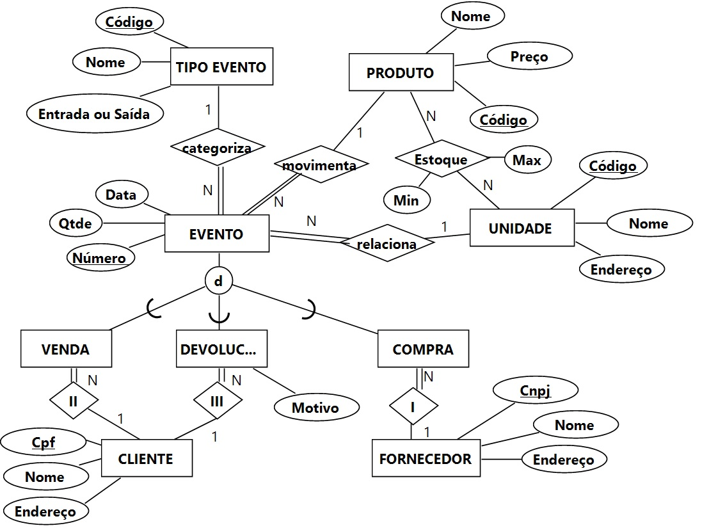

## [Tópico 04b] - Requisitos de Dados - `BD Movimentação de Produtos`
###### *by Prof. Plinio Sa Leitao-Junior (INF/UFG)*

### Evento de produto _vs._ Serviço _vs._ Software _vs._ Banco de Dados

:sparkles: **EVENTO DE PRODUTO** 
`Eventos de produtos` são os eventos que ocasionam a entrada de produto (exemplo: evento de aquisição de produto), a saída de produto (exemplo: evento de venda de produto) e a transferência de produto (exemplo: evento de transferência de produto entre unidades de armazenamento):
- Há várias unidades de armazenamento de produtos.
- Uma unidade de armazenamento pode ser pensada como uma loja física (ou virtual), ou mesmo um 'depósito/armazém' (célula de distribuição), o último é vocacionado a estratégias de otimização [da logística] de distribução de produtos entre as unidades de armazenamento. 

:sparkles: **SERVIÇO** 
`Movimentação de Produtos` é um serviço prestado àqueles que desejam ter a facilidade e a praticidade para a percepção de eventos, os quais compõem e explicam como produtos são movimentados em uma rede de unidades de armazenamento. Noutras palavras, o serviço fornece suporte ao acompanhamento e à administração da movimentação de produtos.

:sparkles: **SOFTWARE** 
Para viabilizar o serviço `Movimentação de Produtos`, vários _softwares_ serão necessários, tais como: _software_ para a aquisição de produtos, _software_ para a venda de produtos, dentre outros.

:sparkles: **BANCO DE DADOS** 
O fornecimento do serviço requer um banco de dados, capaz de viabilizar as funcionalidades dos diversos softwares utilizados.

### Evento _vs._ Tipo de Evento

Qualquer evento envolve _produto_ e _unidade de armazenamento_, bem como a data do evento. Noutras palavras, um evento refere-se <ins>ao acréscimo ou ao decréscimo</ins> de uma quantidade de um produto em uma unidade de armazenamento.

Os **tipos de evento** são: 
&#x270D; **`COMPRA_ENTRADA`**: Uma certa quantidade de um produto é **acrescida** para uma unidade de armazenamento, pertinente à AQUISIÇÃO realizada a partir de um <ins>fornecedor</ins>, ou seja, uma compra para a reposição de estoque. 
&#x270D; **`TRANSFER_SAIDA`**: Uma certa quantidade de um produto é **decrescida** de uma unidade de armazenamento, pertinente à TRANSFERÊNCIA de produtos entre unidades de armazenamento. 
&#x270D; **`TRANSFER_ENTRADA`**: Uma certa quantidade de um produto é **acrescida** para uma unidade de armazenamento, pertinente à TRANSFERÊNCIA de produtos entre unidades de armazenamento. 
&#x270D; **`VENDA_SAIDA`**: Uma certa quantidade de um produto é **decrescida** de uma unidade de armazenamento, pertinente à VENDA do produto para um <ins>cliente</ins>. 
&#x270D; **`DESCARTE_SAIDA`**: Uma certa quantidade de um produto é **decrescida** de uma unidade de armazenamento, pertinente ao DESCARTE do produto, pois o mesmo não tem qualidade para a venda. 
&#x270D; **`AJUSTE_ENTRADA`**: Uma certa quantidade de um produto é **acrescida** para uma unidade de armazenamento, pertinente à CORREÇÃO DE ESTOQUE do produto na unidade de armazenamento. 
&#x270D; **`AJUSTE_SAIDA`**: Uma certa quantidade de um produto é **decrescida** de uma unidade de armazenamento, pertinente à CORREÇÃO DE ESTOQUE do produto na unidade de armazenamento. 
&#x270D; **`DEVOLV_ENTRADA`**: Uma certa quantidade de um produto é **acrescida** para uma unidade de armazenamento, pertinente à DEVOLUÇÃO de produto por um <ins>cliente</ins>.

Vale um realce para alguns tipos de evento: 
&#9745; Uma devolução requer atributos específicos, tais como motivo da devolução (classificação) e descrição.  
&#9745; Em uma transação de transferência de produtos entre duas unidades de armazenamento, dois eventos são registrados: TRANSFER_SAIDA e TRANSFER_ENTRADA. Para os demais tipos de evento, a transação envolve um único evento.

Vale sobressair que cada produto possui quantidades mínima e máxima por unidade de armazenamento. Tal define o estoque planejado do produto na unidade de armazenamento.

### Perfis de Usuário

:star2: `Vendedor` 
O usuário que primariamente utiliza o serviço é chamado de VENDEDOR, aquele interessado em ter estoques de produtos às ações de venda. Basicamente, representa a pessoa que utiliza o serviço para tornar realizável vendas, mas atento ao custo da disponibilidade de produtos em unidades de armazenamento.

:star2: `Fornecedor` 
O usuário que provisiona os produtos é chamado FORNECEDOR, visando a incorporá-los ao acervo das unidades de armazenamento.

:star2: `Gestor` 
O usuário responsável pela gestão administrativa e financeira do serviço é denominado GESTOR.

### Demandas Informacionais

Cliente C 
Unidade de armazenamento U 
Produto P 
Período W (intervalo fechado entre duas data) 

Qual a quantidade do produto P na unidade de armazenamento U ? 
Quais os produtos na unidade de armazenamento U que estão fora da faixa de estoque previsto na unidade ? 
Quais os produtos na unidade de armazenamento U que ficaram fora da faixa de estoque previsto no período W ? 
Que produtos estão com estoque abaixo do mínimo na unidade de armazenamento U ? 
Que produtos possuem maior quantidade de devolução pelos clientes no período W ? 
Que cliente teve maior quantidade de produtos devolvidos no período W ? 
Qual a quantidade do produto P em cada unidades de armazenamento ? 
Qual o histórico de movimentação do produto P na unidade de armazenamento U ? 
Qual unidade de armazenamento possui a maior quantidade do produto P ? 
Quais unidades de armazenamento possuem o produto P disponível ? 

:star2: `Vendedor` 

:star2: `Fornecedor` 

:star2: `Gestor` 

|Esquema Lógico|
|-|
|PRODUTO (Codigo, Preco, Nome) PRODUTO (Codigo) IS PRIMARY KEY|
|UNIDADE (Codigo, Nome, Endereco) UNIDADE (Codigo) IS PRIMARY KEY|
|FORNECEDOR (CNPJ, Nome, Endereco) FORNECEDOR (CNPJ) IS PRIMARY KEY|
|CLIENTE (CPF, Nome, Endereco) CLIENTE (CPF) IS PRIMARY KEY|
|TIPO_EVENTO (Codigo, Nome, EntradaSaida) TIPO_EVENTO (Codigo) IS PRIMARY KEY|
|EVENTO (Numero, Data, Qtde, CodTipoEvento, CodProduto, CodUnidade) EVENTO (Numero) IS PRIMARY KEY EVENTO (CodTipoEvento) REFERENCES TIPO_EVENTO (Codigo) EVENTO (CodProduto) REFERENCES PRODUTO (Codigo) EVENTO (CodUnidade) REFERENCES UNIDADE (Codigo)|

### Bibliografia

[1] ELMASRI, R.; NAVATHE, S. B. Sistemas de Banco de Dados. 6. ed. Pearson, 2011.
