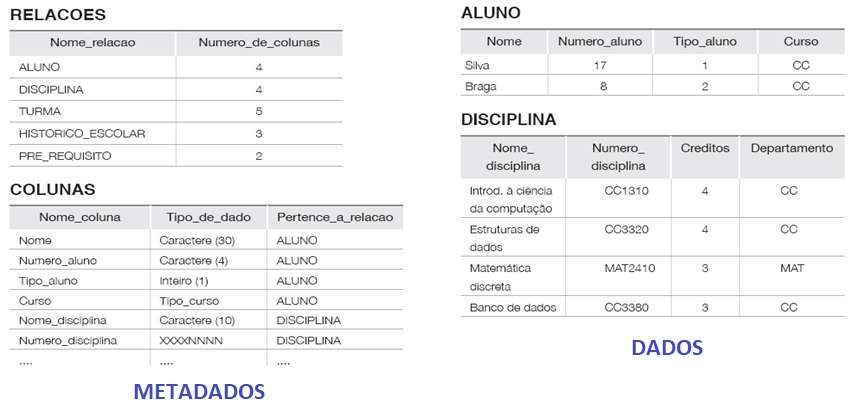

## [Tópico 05] - Dados e metadados
###### *by Prof. Plinio Sa Leitao-Junior (INF/UFG)*

**Definição abstrata de BD**: uma coleção de dados relacionados.

**Propriedades implícitas de BD**
- Uma coleção logicamente coerente de dados com algum significado inerente; um arranjo aleatório de dados não pode ser considerado um banco de dados.
- É projetado e construído com dados para um propósito específico; possui um grupo de usuários e algumas aplicações pré-concebidas, as quais esses usuários estão interessados.
- Representa algum aspecto do mundo real; alterações neste mundo real são refletidas no banco de dados.

> **Em síntese …** Um banco de dados tem alguma fonte na qual os dados são derivados, alguma taxa de interação com eventos do mundo real, e uma audiência que está ativamente interessada em seu conteúdo.

### Dados *vs.* Metadados

**Metadados** descrevem, explicam, localizam ou tornam mais fácil recuperar, usar ou gerenciar um recurso de informação. Os metadados costumam ser chamados de **dados acerca de dados** (ou informações sobre informações).
- **Metadados descritivos** descrevem um recurso para fins de identificação e busca, tais como *título*, *resumo*, *autor* e *palavras-chaves*.
- **Metadados estruturais** indicam como os objetos compostos são colocados juntos, por exemplo, tal como *as páginas são organizadas para formar capítulos*.
- **Metadados administrativos** fornecem informações para ajudar a gerenciar um recurso, tais como *data de criação do arquivo* e *tipo de arquivo*.
- Outro(s).

> Os metadados são essenciais para garantir que os recursos possam *sobreviver* e *permanecer* acessíveis no futuro. 

Para ilustrar a distinção entre **dados** e **metadados**, considere a figura a seguir. O banco de dados **Universidade** é composto por um conjunto de tabelas (no *Modelo Relacional*, fala-se um *conjunto de relações*).

O **acesso** e a **interpretação** dos dados são, essencialmente, baseados nos metadados, pois eles apoiam a solução de questões tais como:
- Em que local estão os dados?
- Quais os caminhos (as alternativas) de acesso aos dados?
- Dentre os caminhos conhecidos para o acesso aos dados, qual é o mais ágil?
- Como os dados estão estruturados?
- Qual o conteúdo por trás desta sequência de caracteres (ou de bits)?
- etc.

No contexto da área de Banco de Dados, a literatura usa vários termos para se referir aos metadados, alguns deles são: *esquema de dados*, *descrição de dados*, *definição dos dados*, *dicionário de dados*, *catálogo de dados*.

## Exercício

Considere o conteúdo do texto [Types of Metadata](../media/types-of-metadata.pdf). Leia e releia o texto. 
Observe que a tabela na segunda página do texto possui 06 linhas, cada linha se refere a um tipo de metadados, conforme a seguir (identificados de 1 a 6):
1. _Descriptive metadata_
1. _Technical metadata_
1. _Preservation metadata_
1. _Rights metadata_
1. _Structural metadata_
1. _Markup languages_
