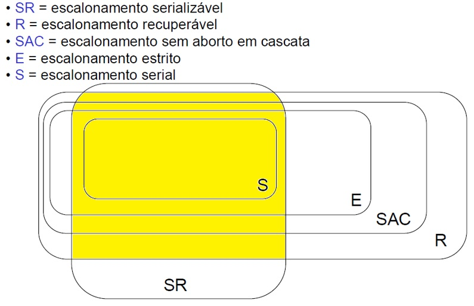

## [Tópico T06b] - Sistema gerenciador de banco de dados (parte 2)
###### *by Prof. Plinio Sa Leitao-Junior (INF/UFG)*

### Escalonamento de transações

### Escalonamento serial _vs._ escalonamento não-serial

### Escalonamento não serial (É serializável?)

### Escalonamento não serial (É recuperável?)

### Conjuntos de escalonamentos

Fim.
