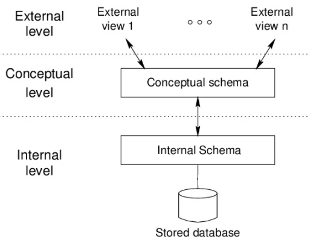

## [Tópico T07] - Modelo de Dados
###### *by Prof. Plinio Sa Leitao-Junior (INF/UFG)*

Um objetivo importante de um sistema de banco de dados é fornecer aos usuários uma percepção abstrata dos dados - o sistema oculta certos detalhes de como os dados são armazenados e mantidos. Nesse sentido, estruturas de dados complexas podem ser ***escondidas*** pelo emprego de vários níveis de abstração, o que simplifica as interações dos usuários com o sistema.

A figura a seguir ilustra uma **arquitetura de três esquemas**, a qual promove a **percepção abstrata dos dados**. O objetivo dessa arquitetura é separar os aplicativos do usuário dos detalhes existentes no banco de dados *físico*:

- **Nível interno (nível físico).** O nível mais baixo de abstração, que descreve como os dados são realmente armazenados, ou seja, a estrutura de armazenamento físico do banco de dados. Representa os detalhes completos de armazenamento de dados e caminhos de acesso para o banco de dados.
- **Nível conceitual.** Este nível de abstração oculta os detalhes das estruturas de armazenamento físico e se concentra na descrição de entidades, tipos de dados, relacionamentos, operações do usuário e restrições. 
*Obs.: há autores que mencionam **nível lógico** (em vez de nível conceitual), sem perda da noção de ocultamento dos detalhes e complexidade em nível físico*.
- **Nível externo (nível visão).** O nível mais alto de abstração, que descreve a parte do banco de dados na qual um determinado grupo de usuários está interessado (uma *visão dos dados*), e oculta o restante do banco de dados desse grupo de usuários. 

A percepção abstrata dos dados lida com a representação do banco de dados em distintos níveis de abstração, a saber: o esquema externo, o esquema conceitual (ou esquema lógico, segundo alguns autores) e esquema físico; ou seja, do mais abstrato para o menos abstrato. Vale ressaltar que os três esquemas são apenas descrições de dados; os dados reais são armazenados concretamente apenas no nível interno (nível físico).

>Nosso curso lida com o **esquema conceitual** e o **esquema lógico**, que se referem a percepções abstratas distintas entre si.

### Independência de dados

Uma consequência da percepção abstrata de dados em níveis é a **independência de dados**, que denota *a capacidade de alterar o esquema em um nível (de um sistema de banco de dados), sem ter que alterar o esquema no nível imediatamente superior*. A literatura usualmente apresenta dois tipos de independência de dados:

1. ***Independência lógica de dados.*** É a capacidade de alterar o esquema conceitual (ou esquema lógico, segundo alguns autores), sem ter que alterar esquemas externos ou programas aplicativos. 
**O que significa "alterar o esquema conceitual (ou esquema lógico, segundo alguns autores)"?** 
Dois exemplos são: adicionar um *tipo de registro* ou *item de dados*, e remover um *tipo de registro* ou *item de dados*. No último caso, os esquemas externos que se referem apenas aos *tipos de registro* ou *itens de dados* restantes (aqueles não removidos) não devem ser afetados. Em adição, as alterações nas restrições de dados aplicadas ao esquema conceitual (ou esquema lógico, segundo alguns autores) em geral não afetam os esquemas externos ou programas de aplicativos.
1. ***Independência física de dados.*** É a capacidade de alterar o esquema interno sem ter que alterar o esquema conceitual (ou esquema lógico, segundo alguns autores). 
**O que significa "alterar o esquema interno"?** 
Dois exemplos são: ordenar os registros de um arquivo e criar um índice para um arquivo de dados. Ambos os exemplos podem promover um caminho de acesso para melhorar a velocidade de acesso aos registros de interesse.

Sobre ambas as independências de dados, a independência física é mais usual ser alcançada, pois os aplicativos (que interagem em geral com a percepção lógica dos dados) não necessitam conhecer detalhes físicos, tal como a localização exata dos dados. Por outro lado, a independência lógica de dados é mais difícil de se alcançar, pois são mais frequentes as mudanças em nível conceitual (ou nível lógico, segundo alguns autores) que afetam o nível externo (por exemplo exclusão de um *item de dado* que é usado em uma *visão dos dados*).

### Modelo de dados

**Modelos de dados** promovem a percepção abstrata em níveis para o banco de dados. Um **modelo de dados** é uma coleção de conceitos que podem ser usados para descrever a estrutura de um banco de dados, relacionamentos de dados, semântica de dados e restrições de consistência. Algumas categorias de modelos de dados são:
- ***Modelo Entidade-Relacionamento (MER).*** Emprega uma **coleção de elementos conceituais** pertinentes aos dados, e cada desses elementos conceituais é classificado como **[tipo de] entidade**, **[tipo de] relacionamento entre entidades** ou **atributo**.
- ***Modelo Relacional (MR).*** Emprega uma **coleção de relações** para representar os dados e os relacionamentos entre esses dados. De forma simples, uma **relação** pode ser percebida como uma **tabela**, ou seja, uma representação 2-D composta por linhas e colunas.
- ***Modelo de dados semiestruturados***. Emprega uma especificação de dados onde itens de dados individuais do mesmo tipo podem ter diferentes conjuntos de atributos. Por exemplo, os atributos que descrevem cada empregado não são uniformes (um empregado é descrito por *CPF*, *Nome* e *Data de Nascimento*, enquanto que outro empregado é descrito por *Nome*, *Local de Nascimento*, *Nome da Mãe* e *Salário*). JSON e XML são amplamente usados em representações de dados semiestruturados.

>Nosso curso lida com o **modelo entidade-relacionamento** e o **modelo-relacional**, para a especificação do **esquema conceitual** e do **esquema lógico** de um banco de dados, respectivamente.

### Para refletir

> *Para que o sistema seja utilizável, ele deve recuperar os dados com eficiência (tempo). A necessidade de eficiência levou os desenvolvedores de sistema de banco de dados a usar estruturas de dados complexas para representar os dados no banco de dados. Uma vez que muitos usuários do sistema de banco de dados não são treinados em computador, os desenvolvedores escondem a complexidade dos usuários por meio de vários níveis de abstração de dados, para permitir que os usuários interajam efetivamente com o sistema.* 

### Exercício

1. _Você consegue **elaborar uma interpretação** (a sua interpretação) sobre **modelos de dados**, que foram inicialmente introduzidos no presente tópico?_
   - Em caso negativo, favor estar atento aos comentários em sala de aula e, se possível, exponha as suas dúvidas. Em adição, busque a literatura recomendada pela disciplina.

### Bibliografia

[1] ELMASRI, R.; NAVATHE, S. B. Sistemas de Banco de Dados. 6. ed. Pearson, 2011.
