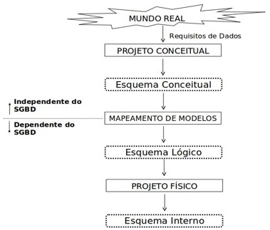
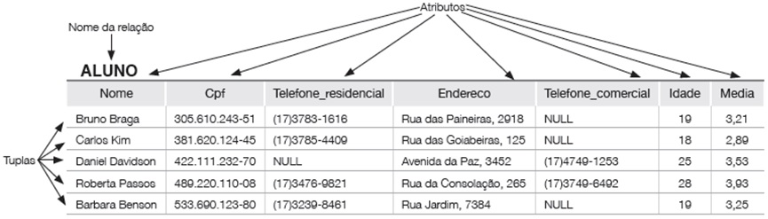

## [Tópico T08] - Modelo Relacional (MR) - Primeiros passos e _Checklist_
###### *by Prof. Plinio Sa Leitao-Junior (INF/UFG)*

O projeto de banco de dados (projeto conceitual, projeto lógico, etc.) emprega modelos de dados para produzir esquemas do banco de dados (esquema conceitual, esquema lógico, etc.). Modelos de dados promovem a percepção abstrata _da estrutura, da composição de conteúdo e das restrições de integridade_ em algum nível de abstração. Nesse sentido, cada modelo de dados se refere a um nível próprio de abstração, para guiar a criação e a evolução de um esquema de banco de dados. 

A figura a seguir apresenta níveis de abstração para os vários esquemas de um mesmo banco de dados.

O **Modelo Relacional (MR)** é comumente aplicado na etapa **projeto lógico** do banco de dados. O projeto lógico lida com a **especificação lógica** do banco de dados (**esquema lógico**), que é uma representação em uma abstração de alto-nível, embora o esquema conceitual seja em nível mais alto do que o esquema lógico.

O modelo relacional representa o banco de dados como uma **coleção de relações**:
- uma relação se assemelha a uma tabela de valores (mas entre os conceitos _relação_ e _tabela_ há dessemelhanças);
- cada linha da tabela possui **valores de dados relacionados**:
  - **uma linha representa um fato**, que normalmente corresponde a uma entidade ou relacionamento do mundo real.

A figura a seguir ilustra a noção de relação, conforme em [1]:

Para o Modelo Relacional (MR), um *checklist* com a maioria dos conceitos deste modelo é apresentado abaixo.

1. Modelo relacional
1. Relação
1. Esquema de relação
1. Esquema de banco de dados relacional
1. Banco de dados _vs._ Instância de banco de dados
1. Nome de relação
1. Atributo
1. Tupla
1. Domínio de atributo
1. Cardinalidade de domínio de atributo
1. Produto cartesiano dos domínios de atributos _vs._ Domínio de relação
1. Grau de uma relação
1. n-tupla
1. Valor NULL
1. Ordenação de tuplas no contexto do modelo relacional?
1. Restrição de integridade 
1. Restrição de integridade de entidade
1. Restrição de integridade referencial
1. Chave primária
1. Chave estrangeira
1. Chave e superchave
1. Chave candidata
1. Operações de manipulação de dados: inserir, excluir e alterar
1. Restrição de chave
1. etc.

>Para que que haja melhor fluência no emprego do MR, é pertinente e importante que entendamos **todos** os conceitos presentes no ***checklist* de conceitos** do MR, apresentado acima.

Esses conceitos serão empregados nos próximos tópicos. Contudo, desde já é mandatório que sejam lidos e estudados no Capítulo 3 do livro sugerido[1]. 

### Exercício

Dentre os conceitos presentes no **_Checklist_ sobre o Modelo Relacional** acima, alguns deles são apresentados abaixo:

**(a)**  Nenhum valor de chave primária pode ser NULL 
**(b)**  Garante a consistência entre tuplas que se relacionam 
**(c)**  Conjunto de esquemas de relação: { R1, R2, ..., Rm } 
**(d)**  Conjunto de relações: { r1(R1), r2(R2), ..., rm(Rm) } 
**(e)**  R(A1, A2, ...,An) 
**(f)**  Conjunto de n-tuplas: { t1, t2, ..., tm } 
**(g)**  Lista ordenada de n valores: <v1, v2, ..., vn> 
**(h)**  Subconjunto do produto Cartesiano dos domínios: r(R) ⊆ ( dom(A1) × dom(A2) × ... × dom(An) ) 
**(i)**  Número total de distintos valores que um atributo pode ter 
 
1. Observe os itens acima de (a) até (i). 
Para cada dos itens acima, identifique o conceito correspondente no *checklist*. 
Responda segundo o modelo: 
&#8718; <**(letra) texto do item no _checklist_**> , alguns exemplos são: 
(a) Chave primária 
(b) Chave estrangeira 
...

### Bibliografia

[1] ELMASRI, R.; NAVATHE, S. B. Sistemas de Banco de Dados. 6. ed. Pearson, 2011.
