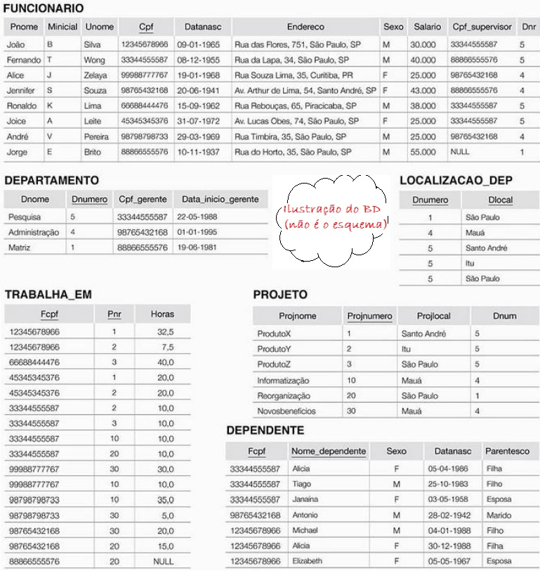

## [Tópico T10a] - Modelo Relacional (MR) - Exercício (parte 1)
###### *by Prof. Plinio Sa Leitao-Junior (INF/UFG)*

Seja abaixo uma [*ilustração para o banco de dados*](../media/fig-mr-2.jpg) **BD Empresa** [1], conforme Modelo Relacional (MR):

**Questão 1)** 
Suponha que cada uma das seguintes operações de atualização seja aplicada diretamente no estado do banco de dados. 
Discuta todas as restrições de integridade violadas por cada operação, se houver, e as diferentes maneiras de lidar com essas restrições. 
(a) Inserir < 'Roberto' , 'F' , 'Santos' , '94377554355' , '21-06-1972' , 'Rua Benjamin, 34, Santo André, SP' , 'M' , 58000 , '88866555576' , 1 > em FUNCIONARIO. 
(b) Inserir < 'ProdutoA' , 4 , 'Santo André' , 2 > em PROJETO. 
(c) Inserir < 'Producao' , 4 , '94377554355' , '01-10-2007' > em DEPARTAMENTO. 
(d) Inserir < '67767898944' , NULL , '40,0' > em TRABALHA_EM. 
(e) Inserir < '45345345376' , 'João' , 'M' , '12-12-1990' , 'marido' > em DEPENDENTE. 
(f) Excluir as tuplas de TRABALHA_EM com Fcpf = '33344555587'. 
(g) Excluir a tupla de FUNCIONARIO com Cpf = '98765432187'. 
(h) Excluir a tupla de PROJETO com Projnome = 'ProdutoX'. 
(i) Modificar Cpf_gerente e Data_inicio_gerente da tupla DEPARTAMENTO com Dnumero = 5 para '12345678966' e '01-01-2007', respectivamente. 
(j) Modificar o atributo Cpf_supervisor da tupla FUNCIONARIO com Cpf = '99988777767' para ''94377554355'. 
(k) Modificar o atributo Horas da tupla TRABALHA_EM com Fcpf = '99988777767' e Prn = 10 para 5. 

**Questão 2)** 
Avalie se as consultas abaixo podem ser atendidas pelo banco de dados **BDEmpresa**: 
(a) que empregados trabalham no departamento 'Pesquisa' ? 
(b) qual o nome dos empregados que são gerentes de departamento ? 
(c) qual o nome dos empregados que trabalham em algum projeto ? 
(d) qual o nome dos empregados que não possuem dependentes ? 
(e) que projetos possuem gerentes de departamento dentre os seus trabalhadores ? 
(f) quais projetos possuem mais de um local ? 
(g) quais os departamentos descentralizados ? 
(h) que pessoas dependem de mais de um empregado ? 
(i) quais os empregados que trabalham para mais de um departamento ? 
(j) quais os dependentes que possuem mais de um empregado responsável ? 
(k) quais os gerentes de departamento que também são supervisores ? 
(m) quais os gerentes de departamento que também são dependentes de outros empregados ? 
(n) que departamentos possuem duas unidades em um mesmo local ? 
(o) que empregados trabalham para um departamento que controla algum projeto que eles  trabalham em ? 
(p) quais os projetos que possuem mais de um empregado trabalhando ? 
(q) quais os projetos controlados por mais de um departamento ? 
(r) quais os departamentos que controlam mais de um projeto ? 
(s) que empregados possuem mais de dois dependentes ? 
(t) que departamento possui salário médio de seus empregados acima de um certo valor ? 
(u) qual a média salarial de cada departamento ? 
(v) qual o maior salário de dependente para cada empregado ? 
(w) quando um empregado iniciou como responsável de um determinado dependente ? 
(x) quais os departamentos que controlam projetos sem dependentes ? 
(y) qual a meta de faturamento de cada empregado ? 
(z) quanto empregados trabalham para departamentos que possuem mais de 5 empregados ? 
(a1) quais os departamentos que mais possuem dependentes para seus empregados ? 
(b1) quantos empregados aposentados existem na empresa ? 
(c1) quantos empregados ganham salário mínimo na empresa ? 
(d1) quantos empregados já estão em idade de aposentar-se ? 
(e1) quais os empregados casados ? 
(f1) que empregados moram próximo do local de trabalho ? 
(g1) que empregados possuem entre certa faixa etária ? 
(h1) que empregados possuem um determinado sobrenome ? 
(i1) que departamentos tiveram mais de um gerente no último ano ? 
(j1) que empregados foram gerentes de mais de um departamento ? 
(k1) qual a carga horária média semanal de horas trabalhadas em cada projeto ? 
(l1) qual a carga horária média semanal de horas trabalhadas em cada projeto no último mês ? 
(m1) quais os empregados que possuem mais de um supervisionado direto ? 
(n1) que supervisores trabalham em departamentos distintos dos seus supervisionados ? 
(o1) que supervisores são mais jovens que algum de seus supervisionados ? 

**Questão 3)** 
Sobre as sentenças abaixo, marque V para verdadeiro e F para falso: 
(  ) um dependente é identificado somente pelo atributo Nome; 
(  ) um empregado pode possuir diversos supervisores; 
(  ) um empregado pode trabalhar em diversos projetos, mas deve trabalhar para somente um departamento; 
(  ) um projeto deve ser controlado por um departamento, o qual possui empregados que trabalham neste projeto; 
(  ) pelo menos um empregado deve trabalhar em cada projeto, o qual é sempre controlado por algum departamento. 

### Bibliografia

[1] ELMASRI, R.; NAVATHE, S. B. Sistemas de Banco de Dados. 6. ed. Pearson, 2011.
