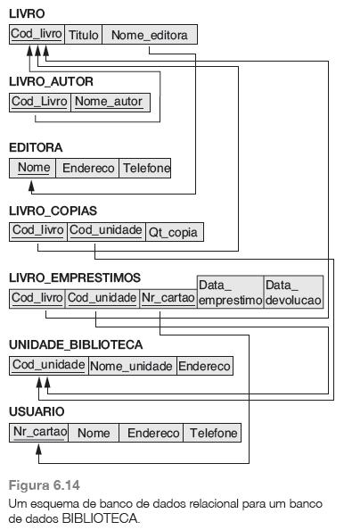

## [Tópico T10b] - Modelo Relacional (MR) - Exercício (parte 2)
###### *by Prof. Plinio Sa Leitao-Junior (INF/UFG)*

Seja abaixo o Esquema Lógico para o **BD Empresa** [1]:
- As restrições de integridade referencial aparecem como arcos diretos.

**Questão 1)** 
Reflita sobre um "caminho" para o processamento de cada das consultas abaixo: 
(a) Quantas cópias do livro intitulado “Tribo Perdida” existem na unidade da biblioteca cujo nome é “Central” ? 
(b) Quantas cópias do livro intitulado “Tribo Perdida” existem em cada unidade da biblioteca ? 
(c) Recupere o nome de todos os usuários que não possuem livros registrados em seu nome. 
(d) Para cada livro que é emprestado da unidade Central e cuja data de devolução é hoje, recupere o título do livro, o nome e o endereço do usuário. 
(e) Para cada unidade da biblioteca, recupere o nome da unidade e o número total de livros retirados de lá. 
(f) recupere o nome, endereço e número de livros emprestados para todos os usuários que possuem mais de cinco livros emprestados. 
(g) Para livro cujo autor (ou coautor) é Stephen King, recupere o título e o número de cópias pertencentes à unidade da biblioteca cujo nome é “Central”. 

### Bibliografia

[1] ELMASRI, R.; NAVATHE, S. B. Sistemas de Banco de Dados. 6. ed. Pearson, 2011.
