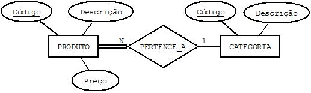

## [Tópico T11] - Álgebra Relacional - Fundamentos e Primeiras operações
###### *by Prof. Plinio Sa Leitao-Junior (INF/UFG)*

A ***Álgebra Relacional*** é uma _linguagem formal_ para o Modelo Relacional (MR):
- É considerada parte integrante do próprio Modelo de Dados Relacional.
- Possui um ***conjunto de operações***, que tipicamente são aplicadas a **esquemas lógicos** do MR.
- As operações podem ser empregadas para a manipulação de dados: consulta, inclusão, alteração e exclusão de dados.

Sobre as **Operações da Álgebra Relacional**:
- A **entrada** de uma operação pode ser:
  - uma única relação (tabela) - operação unária; ou
  - duas relações - operação binária.
- A **saída** de uma operação é uma nova relação:
  - se for uma operação de consulta (solicitação de recuperação), a operação retorna em uma nova relação (mas não modifica o [conteúdo do] banco de dados);
  - se for uma operação de atualização (inserção, remoção ou modificação de _tuplas_), a operação potenciamente altera o [conteúdo do] banco de dados (mas não retorna qualquer relação).
- Operações podem ser (usualmente são) aninhadas, tal que o resultado de uma operação é a entrada de outra operação.
- Em termos formais, há dois grupos de operações:
  - baseada na teoria matemática de conjuntos, tais como UNIÃO, INTERSEÇÃO, DIFERENÇA e PRODUTO CARTESIANO;
  - criada especificamente para bancos de dados relacionais, tais como  SELEÇÃO, PROJEÇÃO e JUNÇÃO, entre outras.

### Ilustração do BD Simples

Para exemplificar algumas das operações da Álgebra Relacional, considere a ilustração a seguir, referente a um banco de dados simples (**BD Simples**).

CATEGORIA
| <ins>CodCateg</ins> | Nome |
|-|-|
| **papel** | Papelaria e escritório |
| **esporte** | Material esportivo |

PRODUTO
| <ins>CodProduto</ins> | Descrição | Preço | _Categ_ |
|-|-|-|-|
| **1234** | Lápis | 0.70 | _papel_ |
| **1111** | Bola | 20.00 | _esporte_ |
| **2222** | Caneta | 1.20  | _papel_ |
| **1212** | Meião | 12.40 | _esporte_ |
| **1112** | Viseira| 12.40 | _esporte_ |

### Operação SELEÇÃO (SELECT)

A **Operação SELEÇÃO** é usada para obter um subconjunto das _tuplas_ de uma relação, as quais devem satisfazer a um **predicado de seleção** (condição de seleção):
- O símbolo **σ** identifica a operação.
- O número de _tuplas_ resultante da operação é igual ou menor ao número de _tuplas_ da entrada.

**[Pergunta]** A Operação SELEÇÃO é comutativa ? 
&#8718; noutras palavras, σ<cond1>(σ<cond2>(R)) = σ<cond2>(σ<cond1>(R)) ? 
**[Pergunta]** Uma sequência (cascata) de operações pode ser combinada em um única operação ? 
&#8718; noutras palavras, σ<cond1>(σ<cond2>(... (σ<condn>(R)) ...)) = σ<cond1> AND<cond2> AND...AND <condn>(R) ?

#### SELEÇÃO Exemplo 1:
A expressão **σ Categ="papel" (PRODUTO)** resulta em
| CodProduto | Descrição | Preço | _Categ_   |
|-|-|-|-|
| **1234** | Lápis | 0.70 | _papel_ |
| **2222** | Caneta | 1.20  | _papel_ |

#### SELEÇÃO Exemplo 2:
A expressão **σ Categ="esporte" &#x0245; Preço>15.00 (PRODUTO)** resulta em
| CodProduto | Descrição | Preço | _Categ_   |
|-|-|-|-|
| **1111** | Bola | 20.00 | _esporte_ |

### Operação PROJEÇÃO (PROJECT)

A **Operação PROJEÇÃO** é empregada para selecionar atributos de uma relação (colunas de uma tabela):
- O símbolo **π** identifica a operação.
- O número de _tuplas_ resultante da operação é igual ou menor ao número de _tuplas_ da entrada.

**[Pergunta]** A Operação PROJEÇÃO é comutativa ? 
&#8718; noutras palavras, π<list1>(π<list2>(R)) = π<list2>(π<list1>(R)) ? 

#### PROJEÇÃO Exemplo 1:
A expressão **π CodProduto, Preço (PRODUTO)** resulta em
| CodProduto | Preço |
|-|-|
| 1234 | 0.70 |
| 1111 | 20.00 |
| 2222 | 1.20 |
| 1212 | 12.40 |
| 1112 | 12.40 |

#### PROJEÇÃO Exemplo 2:
A expressão **π Preço, Categ (PRODUTO)** resulta em
| Preço | Categ |
|-|-|
| 0.70 | papel |
| 20.00 | esporte |
| 1.20  | papel |
| 12.40 | esporte |
| ~~12.40~~ | ~~esporte~~ |

IMPORTANTE: 
No Exemplo 2, a última _tupla_ é excluída do resultado da consulta. 
Por quê?

**Combinando operações:** 
Neste exemplo, as operações SELEÇÃO e PROJEÇÃO são combinadas em um única expressão. 
A expressão **π CodProduto, Preço (σ Categ="papel" (PRODUTO))** resulta em
| CodProduto | Preço |
|-|-|
| 1234 | 0.70 |
| 2222 | 1.20 |

### Operação RENOMEAÇÃO#1 (RENAME#1)

A **Operação RENOMEAÇÃO#1** aplica a renomeação da relação e/ou dos atributos do resultado de uma operação:
- A renomeação é restrita aos resultados das operações, não afeta o banco de dados.
- O símbolo **&#8592;** identifica a operação.
- As seguintes construções estão disponíveis:
  - **S &#8592; <expressão>**
  - **S(B1, B2, ... , Bn) &#8592; <expressão>**

#### RENOMEAÇÃO#1 Exemplo 1:
A expressão **π CodProduto, Preço (σ Categ="papel" (PRODUTO))** pode ser reescrita como um sequência de duas expressões: 
&#8718; TEMP &#8592; σ Categ="papel" (PRODUTO) 
&#8718; RESULT &#8592; π CodProduto, Preço (TEMP) 
Esta sequência de expressões resulta em 

RESULT
| CodProduto | Preço |
|-|-|
| 1234 | 0.70 |
| 2222 | 1.20 |

#### RENOMEAÇÃO#1 Exemplo 2:
Outra alternativa para renomeação: 
&#8718; TEMP &#8592; σ Categ="papel" (PRODUTO) 
&#8718; RESULT(Código, Valor) &#8592; π CodProduto, Preço (TEMP) 
Esta sequência de expressões resulta em 

RESULT
| Código | Valor |
|-|-|
| 1234 | 0.70 |
| 2222 | 1.20 |

> No primeiro exemplo, houve a _renomeação da relação resultante_ em cada expressão:
>> TEMP e RESULT são novos nomes para o resultado de cada expressão.

> No segundo exemplo, houve **também** a _renomeação de atributos_ na segunda expressão:
>> _Código_ e _Valor_ são novos nomes dos atributos para o resultado da segunda expressão.

### Operação RENOMEAÇÃO#2 (RENAME#2)

A **Operação RENOMEAÇÃO#2** ***também*** aplica a renomeação da relação e/ou dos atributos do resultado de uma operação:
- A renomeação é restrita aos resultados das operações, não afeta o banco de dados.
- O símbolo **ρ** identifica a operação.
- As seguintes construções estão disponíveis:
  - **ρS(B1, B2, ... , Bn)(<expressão>)**
  - **ρS(<expressão>)**
  - **ρ(B1, B2, ... , Bn)(<expressão>)**

#### RENOMEAÇÃO#2 Exemplo 1:
Seja a sequência de expressões: 
&#8718; **ρ TEMP (σ Categ="papel" (PRODUTO))** 
&#8718; **ρ RESULT(Código, Valor) (π CodProduto, Preço (TEMP))** 
Esta sequência de expressões resulta em 

RESULT
| Código | Valor |
|-|-|
| 1234 | 0.70 |
| 2222 | 1.20 |

### Em síntese ...

O presente tópico introduziu três operações básicas da álgebra relacional, a saber: SELEÇÃO, PROJEÇÃO e RENOMEAÇÃO (#1 e #2). 
**O entendimento dessas operações é crucial para a apropriação de novos conteúdos da álgebra relacional.**

### Para refletir 01 ...

Em relação ao **BD Simples**, cuja ilustração está no início do presente tópico, qual o resultado da sequência de expressões da álgebra relacional? 
&#8718; **ρ S1 (π CodProduto, Descrição, Preço, Categ (PRODUTO))** 
&#8718; **ρ S2 (π Descrição, Preço, Categ (S1))** 
&#8718; **ρ S3 (π Preço, Categ (S2))** 
&#8718; **ρ RESULT (π Categ (S3))**

### Para refletir 02 ...

Sobre o [Tópico 09](./topico-09.md), é possível uma chave estrangeira composta por vários atributos?

MUNICIPIO (<ins>Nome, Estado</ins>, Região) 
| <ins>Nome</ins> | <ins>Estado</ins> | Região |
|-|-|-|
| **Santa Rosa** | **GO** | Centro-oeste |
| **Goiânia** | **GO** | Centro-oeste |
| **Santa Rosa** | **MG** | Sudeste |

BAIRRO (<ins>Cidade, UF, Nome</ins>, Area) 
BAIRRO (Cidade, UF) REFERENCIA MUNICIPIO (Nome, Estado) 
| <ins>Cidade</ins> | <ins>UF</ins> | <ins>Nome</ins> | Área |
|-|-|-|-|
| **Santa Rosa** | **GO** | **Centro** | 100 |
| **Santa Rosa** | **MG** | **Oeste** | 120 |
| **Santa Rosa** | **MG** | **Centro** | 111 |

## Exercício

Um banco de dados simples (**BD Simples**) possui o seguinte esquema conceitual: 
_<<apenas para ilustrar, pois ainda não estudamos o modelo entidade-relacionamento (elaborar o esquema conceitual)>>_

O projetista de banco de dados analisou o diagrama acima e criou o esquema lógico, conforme abaixo: 
&#8718; PRODUTO(<ins>CodProduto</ins>, Descrição, Preço, _Categ_) 
&#8718; CATEGORIA(<ins>CodCateg</ins>, Nome) 
&#8718; PRODUTO(Categ) REFERENCIA CATEGORIA(CodCateg) 
Noutras palavras: 
&#8718; os esquemas de relação PRODUTO(CodProduto, Descrição, Preço, Categ) e CATEGORIA(CodCateg, Nome); 
&#8718; as chaves primárias (PKs) _CodProduto_ e _CodCateg_ para PRODUTO e CATEGORIA, respectivamente; 
&#8718; o atributo _Categ_ é uma chave estrangeira (FK) em PRODUTO que referencia CATEGORIA.

#### Em relação ao BD Simples, considere o "esquema lógico" (acima) e a "ilustração" (no início do tópico) para executar esta atividade.

1. Quais as restrições de integridade - _domínio_, _chave_, _integridade de entidade_ e _integridade referencial_ - são violadas em cada uma das seguintes operações? 
**(a)** Incluir a _tupla_ **<NULL,"Boné",12.00,"vestuário">** em PRODUTO. 
**(b)** Incluir a _tupla_ **<1212,"Borracha",2.10,"papel">** em PRODUTO. 
**(c)** Incluir a _tupla_ **<1212,2.10,"Borracha","papel">** em PRODUTO. 
**(d)** Alterar a _tupla_ **<"papel","Papelaria e escritório">** para **<"papeis","Papelaria e Outros">** em CATEGORIA. 
**(e)** Excluir a _tupla_ **<"papel","Papelaria e escritório">** em CATEGORIA. 
**(g)** Alterar a _tupla_ **<"papel","Papelaria e escritório">** para **<"papelaria","Papelaria e Escritório">** em CATEGORIA. 
**(h)** Excluir a _tupla_ **<1111,"Bola",20.00,"esporte">** em PRODUTO.

IMPORTANTE: 
&#8718; Para analisar cada operação, considere o banco de original conforme a ilustração. Por exemplo, para analisar a operação em (d), desconsidere possíveis modificações no banco de dados pelas operações em (a), (b) e (c). 
&#8718; Ao responder, calcule o somatório dos números que identificam cada restrição violada pela operação, e acrescente o número de letras do seu primeiro nome (o primeiro nome do discente): 
(01) Restrição de domínio 
(02) Restrição de chave 
(04) Restrição de integridade de entidade 
(08) Restrição de integridade referencial 

&#8718; Para ilustrar, se o seu primeiro nome é 'Pedro' (05 letras) e as restrições violadas são 'restrição de domínio' e 'restrição de chave', responda da seguinte forma (apenas para exemplificar): 
(a) **08**: Restrição de domínio , Restrição de chave 
(b) ... 
&#8718; Responda, **necessariamente**, neste formato.

