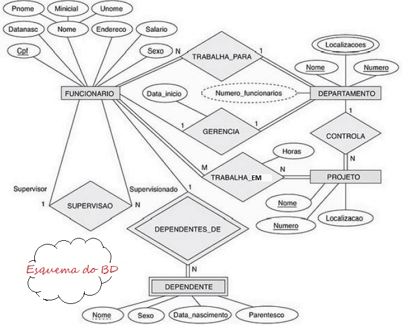
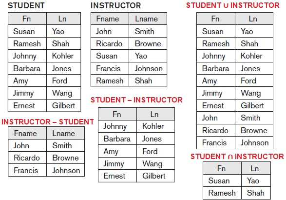

## [Tópico T13a] - Álgebra Relacional - União, Interseção, Diferença
###### *by Prof. Plinio Sa Leitao-Junior (INF/UFG)*

Para ilustrar as operações da Álgebra Relacional, considere os esquemas (conceitual e lógico) do BD Empresa.

### Operações UNIÃO (UNION), INTERSEÇÃO (INTERSECTION) e DIFERENÇA (MINUS)

UNIÃO, INTERSEÇÃO e DIFERENÇA são operações binárias baseadas na **Teoria dos Conjuntos**:
- Envolvem a comparação dos elementos (_tuplas_) presentes nos dois conjuntos (duas relações) de entrada.
- Para comparar as _tuplas_ presentes nas duas relações de entrada, as _tuplas_ devem ser do mesmo tipo, ou seja, deve haver **compatibilidade de união** (compatibilidade de tipo):
  - as relações **R (A1, A2, ..., An)** e **S (B1, B2, ..., Bn)** são ditas ***união-compatíveis*** se:
    - tiverem o mesmo grau **n** (R e S têm o mesmo número de atributos); e
    - **dom(Ai) = dom( Bi)** para **1 ≤ i ≤ n** (cada par de atributos correspondente tem o mesmo domínio).
- UNIÃO: O resultado de **R ∪ S** é uma relação que inclui todas as _tuplas_ que estão em **R** ou em **S**, ou em **R** e **S**. _Tuplas_ duplicadas são eliminadas.
- INTERSEÇÃO: O resultado de **R ∩ S** é uma relação que inclui todas as _tuplas_ que estão em **R** e **S**.
- DIFERENÇA: O resultado de **R - S** é uma relação que inclui todas as tuplas que estão em **R**, mas não em **S**.

A figura abaixo ilustra a aplicação das operações.

**Questões**: 
■ R ∪ S = S ∪ R ? 
■ R ∩ S = S ∩ R ? 
■ R - S = S - R ? 
■ R ∪ (S ∪ T ) = (R ∪ S) ∪ T ? 
■ (R ∩ S) ∩ T = R ∩ (S ∩ T) ? 

#### UNIÃO, INTERSEÇÃO e DIFERENÇA Exemplo 1:

Qual o CPF dos funcionários que trabalham no **departamento 5** 
**ou / e / mas não** 
supervisionam diretamente um funcionário que trabalha no **departamento 5**?

|Expressão|Operação|
|-|-|
|**FUNC_DEPTO_5 ← σDnr=5(FUNCIONARIO)**|RENOMEAÇÃO, SELEÇÃO|
|**TRABALHA_DEPTO_5 ← πCpf(FUNC_DEPTO_5)**|RENOMEAÇÃO, PROJEÇÃO|
|**SUPERVISIONA_DEPTO_5(Cpf) ← πCpf_supervisor(FUNC_DEPTO_5)**|RENOMEAÇÃO, PROJEÇÃO|
|**RESULT1 ← TRABALHA_DEPTO_5 ∪ SUPERVISIONA_DEPTO_5**|RENOMEAÇÃO, ***UNIÃO***|
|**RESULT2 ← TRABALHA_DEPTO_5 ∩ SUPERVISIONA_DEPTO_5**|RENOMEAÇÃO, ***INTERSEÇÃO***|
|**RESULT3 ← TRABALHA_DEPTO_5 - SUPERVISIONA_DEPTO_5**|RENOMEAÇÃO, ***DIFERENÇA***|

#### UNIÃO, INTERSEÇÃO e DIFERENÇA Exemplo 2:

As operações abaixo estão corretas? 
■ FUNCIONARIO ∪ DEPARTAMENTO 
■ FUNCIONARIO ∩ DEPARTAMENTO 
■ FUNCIONARIO - DEPARTAMENTO

#### UNIÃO, INTERSEÇÃO e DIFERENÇA Exemplo 3:

Qual o CPF dos funcionários que são supervisores e gerentes de departamento? 
■ _escreva a consulta em álgebra relacional_...

#### UNIÃO, INTERSEÇÃO e DIFERENÇA Exemplo 4:

Qual o CPF e o nome dos funcionários que são supervisores e gerentes de departamento? 
■ _escreva a consulta em álgebra relacional_...

#### UNIÃO, INTERSEÇÃO e DIFERENÇA Exemplo 5:

Qual o maior salário da empresa? 
■ _escreva a consulta em álgebra relacional_...

## Exercício

Considere o **esquema lógico** do Banco de Dados Empresa, apresentado no início do presente tópico.

1. Escreva a seguinte consulta em Álgebra Relacional: **Qual o nome dos funcionários que trabalham em mais de um projeto?**

IMPORTANTE:
- Use, necessariamente (somente), as operações da álgebra relacional apresentadas até o presente tópico.
