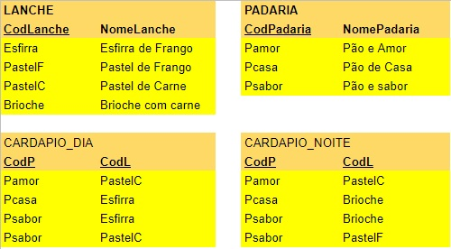

## [Tópico T13b] - Álgebra Relacional - Junção _vs._ União, Interseção, Diferença
###### *by Prof. Plinio Sa Leitao-Junior (INF/UFG)*

### Qual a diferença entre as operações JUNÇÃO e UNIÃO (também INTERSEÇÃO e DIFERENÇA)?

Sobre ambas as operações:
- A operação JUNÇÃO recebe duas relações de entrada.
- A operação UNIÃO (também INTERSEÇÃO e DIFERENÇA) recebe duas relações de entrada.
- **Cada _tupla_** do resultado da operação JUNÇÃO entre **R** e **S** é:
  - a concatenção de uma _tupla_ de **R** com uma _tupla_ de **S**.
- **Cada _tupla_** do resultado da operação UNIÃO (também INTERSEÇÃO e DIFERENÇA) é:
  - uma _tupla_ de **R**; OU
  - uma _tupla_ de **S**.

Para esclarecer a distinção entre JUNÇÃO e UNIÃO (também INTERSEÇÃO e DIFERENÇA), considere a ilustração abaixo, que se refere ao banco de dados de uma aplicação focada no fornecimento de lanches (**BD Lanches**).  As relações CARDAPIO_DIA e CARDAPIO_NOITE se referem aos lanches que são servidos durante o dia e durante a noite, respectivamente.

#### Exemplo 1 - JUNÇÃO:

**Para os lanches servidos durante o dia, qual o nome da padaria e o lanche servido?**

&nbsp;&nbsp;Para atender à consulta, é necessário fazer a JUNÇÃO entre PADARIA e CARDAPIO_DIA. 
&nbsp;&nbsp;Cada _tupla_ do resultado da consulta terá dados de ambas ad relações: PADARIA e CARDAPIO_DIA.

∎ **AUX1 ← PADARIA ⋈ CodPadaria=CodP CARDAPIO_DIA** 

|CodPadaria|NomePadaria|Pamor|PastelC|
|-|-|-|-|
|Pamor|Pão e Amor|Pamor|PastelC|
|Pcasa|Pães de Casa|Pcasa|Esfirra|
|Psabor|Pão e Sabor|Psabor|Esfirra|
|Psabor|Pão e Sabor|Psabor|PastelC|

∎ **π NomePadaria, CodL (AUX1)**

|NomePadaria|CodL|
|-|-|
|Pão e Amor|PastelC|
|Pães de Casa|Esfirra|
|Pão e Sabor|Esfirra|
|Pão e Sabor|PastelC|

#### Exemplo 2 - INTERSEÇÃO:

**Quais os lanches são servidos durante o dia e durante a noite?**

&nbsp;&nbsp;Para atender à consulta, é necessário fazer a INTERSEÇÃO entre CARDAPIO_DIA e CARDAPIO_NOITE. 
&nbsp;&nbsp;Não há a concatenação de uma _tupla_ de CARDAPIO_DIA com uma _tupla_ de CARDAPIO_NOITE. 

∎ AUX1 ← π CodL CARDAPIO_DIA 

|CodL|
|-|
|PastelC|
|Esfirra|

∎ AUX2 ← π CodL CARDAPIO_NOITE 

|CodL|
|-|
|PastelC|
|Brioche|
|PastelF|

∎ AUX1 ∩ AUX2 

|CodL|
|-|
|PastelC|

> Em resumo, ...
>> Qual a conclusão que você poderia escrever sobre o conteúdo acima ?
