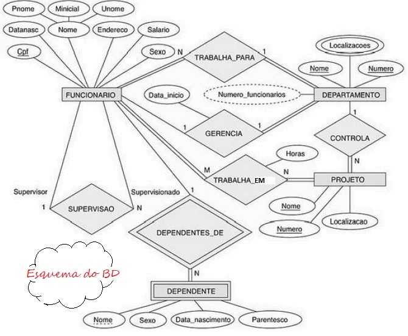
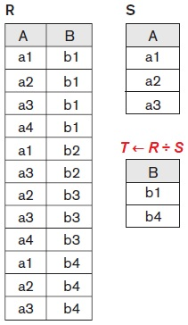

## [Tópico T14] - Álgebra Relacional - Divisão, Função Agregada, Agrupamento
###### *by Prof. Plinio Sa Leitao-Junior (INF/UFG)*

Para ilustrar as operações da Álgebra Relacional, considere os esquemas (conceitual e lógico) do BD Empresa.

### Operação DIVISÃO (DIVISION)

A figura abaixo ilustra a operação DIVISÃO.

A operação DIVISÃO é usualmente referida como "para todas":
- Em T ← R ÷ S na figura:
  - o conjunto de atributos de **R** é **XR = {A, B}**;
  - o conjunto de atributos de **S** é **XS = {A}**;
  - os atributos de **S** são um subconjunto dos atributos de **R**, isto é, **XS ⊆ XR**;
  - o conjunto de atributos de T é **XR - XS = {B}**;
  - cada _tupla_ em **T** se refere às _tuplas_ de **R** que existem "para todas" as _tuplas_ de **S**, conforme ilustrado na figura.

#### DIVISÃO Exemplo 1:

Qual o nome dos funcionários que trabalham em todos os projetos que o "João Silva" trabalha?

|Expressão|Operação|
|-|-|
|**SILVA ← σPnome=‘João’ AND Unome=‘Silva’(FUNCIONARIO)**|RENOMEAÇÃO, SELEÇÃO|
|**PROJETOS_SILVA ← πPnr(TRABALHA_EM ⋈Fcpf=CpfSILVA)**|RENOMEAÇÃO, EQUIJUNÇÃO, PROJEÇÃO|
|**PROJETOS_TODOS_FUNCS ← πFcpf, Pnr(TRABALHA_EM)**|RENOMEAÇÃO, PROJEÇÃO|
|**FUNC(Cpf) ← PROJETOS_TODOS_FUNCS ÷ PROJETOS_SILVA**|RENOMEAÇÃO, ***DIVISÃO***|
|**RESULT ← πPnome, Unome(FUNC * FUNCIONARIO)**|RENOMEAÇÃO, JUNÇÃO NATURAL, PROJEÇÃO|

#### DIVISÃO Exemplo 2:

Qual o nome dos funcionários que possui o mesmo salário do "João Silva"? 
■ _escreva a consulta em álgebra relacional_...

### FUNÇÃO AGREGADA (AGGREGATE FUNCTION) e AGRUPAMENTO (GROUPING)

As **FUNÇÕES AGREGADAS** usam funções matemáticas para cálculos estatísticos simples nos conjuntos do banco de dados:
- O símbolo ℑ identifica a operação (_F Script_).
- A funções agregadas são CONTA (COUNT), SOMA (SUM), MÉDIA (AVERAGE), MÁXIMO (MAXIMUM) e MÍNIMO (MINIMUM).
- Alguns exemplos de aplicação das funções agregadas são:
  - qual a média dos salários dos funcionários?
  - qual a soma dos salários dos funcionários?
  - qual o número (a quantidade) de funcionários?

#### FUNÇÃO AGREGADA e AGRUPAMENTO Exemplo 1:

Qual a quantidade de funcionários bem como a soma e a média de salários da empresa? 
■ ℑ CONTA Cpf, SOMA Salario, MÉDIA Salario (FUNCIONARIO)

O **AGRUPAMENTO** envolve o **agrupamento de _tuplas_** em uma relação, a partir do valor um ou mais atributos:
- Os atributos usados para estabelecer o agrupamento de _tuplas_ são denominados **atributos de agrupamento**. 
- Cada grupo é formado pelas _tuplas_ que possuem o mesmo valor para os **atributos de agrupamento**.
- A sintaxe genérica para o agrupamento é:
  - **atributos-de-agrupamento ℑ lista-de-funções-agregadas (R)**
- A relação resultante é formada pelos valores dos atributos de agrupamento e pelos valores das funções agregadas.

#### FUNÇÃO AGREGADA e AGRUPAMENTO Exemplo 2:

Qual a quantidade de funcionários e média salarial por departamento da empresa? 
■ Dnr ℑ CONTA Cpf, MÉDIA Salario (FUNCIONARIO) 
OU 
■ ρ RESULT (Identificacao_do_departamento, Quantidade_de_empregados, Salario_medio) (Dnr ℑ CONTA Cpf, MÉDIA Salario (FUNCIONARIO))

#### FUNÇÃO AGREGADA e AGRUPAMENTO Exemplo 3:

Qual o nome dos funcionários que possuem dois ou mais dependentes?

|Expressão|Operação|
|-|-|
|RESUMO(Cpf, Qtde_depend)← Fcpf ℑ CONTA Fcpf (DEPENDENTE)|RENOMEAÇÃO, ***FUNÇÃO AGREGADA***, ***AGRUPAMENTO***|
|RESUMO_DOIS ← σ Qtde_depend >= 2 (RESUMO)|RENOMEAÇÃO, SELEÇÃO|
|RESULT ← π Pnome, Unome (RESUMO_DOIS * FUNCIONARIO)|RENOMEAÇÃO, JUNÇÃO NATURAL, PROJEÇÃO|

### Exercício  

Escreva em álgebra relacional as seguintes consultas ao BD Empresa: 
1. Qual o nome dos funcionários, que possuem mais de um dependente e trabalham em mais de um projeto?
1. Qual o nome dos dependentes, cujo funcionário responsável pelo dependente é supervisor direto de mais de um funcionário?

IMPORTANTE: Use a sintaxe da Álgebra Relacional conforme os exemplos apresentados.
