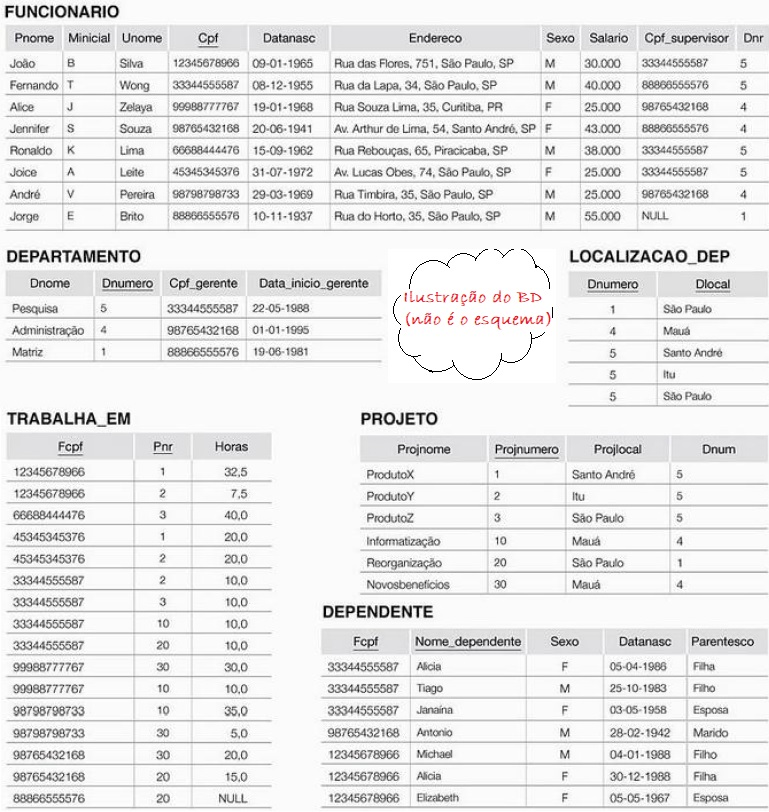

## [Tópico T16b] - Álgebra Relacional - Exercícios
###### *by Prof. Plinio Sa Leitao-Junior (INF/UFG)*

Para apoiar os exercícios e exemplo sobre as operações da Álgebra Relacional, considere a ilustração abaixo do **BD Empresa**.

Escreva em álgebra relacional as seguintes consultas:

1. Qual o nome dos projetos que o funcionário "João B Silva" trabalha em? 
1. Qual o nome das pessoas que trabalham em pelo menos um dos projetos que o funcionário "João B Silva" trabalha em? 
1. Qual o nome das pessoas que não trabalham em qualquer dos projetos que o funcionário "João B Silva" trabalha em? Pessoas que não trabalham em qualquer projeto ESTÃO INCLUÍDAS no resultado da consulta. 
1. Qual o nome das pessoas em que todos os projetos que trabalham em estão entre os projetos que o funcionário "João B Silva" trabalha em? Pessoas que não trabalham em qualquer projeto NÃO ESTÃO INCLUÍDAS no resultado da consulta. 

IMPORTANTE: Use a sintaxe da Álgebra Relacional conforme os exemplos apresentados até então.
