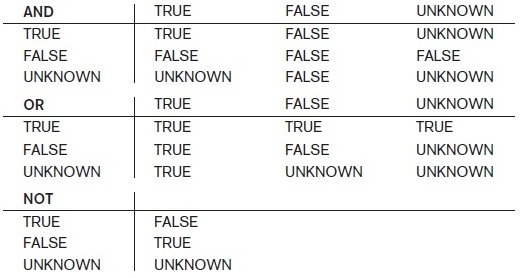
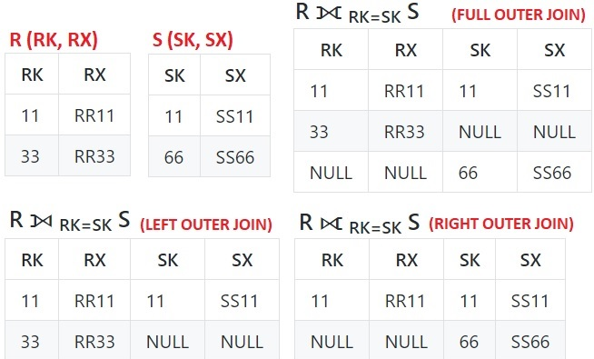

## [Tópico T20] - SQL - DML (Data Manipulation Language): Junção, Junção Natural, Valor nulo, Junção Externa
###### *by Prof. Plinio Sa Leitao-Junior (INF/UFG)*

Os exemplos apresentados usam o esquema lógico do **BD Empresa**, conforme abaixo.

### Exemplo 01: Desambiguação de atributos 1
#### Para cada dependente, apresente o nome e o sexo do dependente, bem como o nome e o sexo do funcionário responsável pelo dependente.

Observe que existe o atributo **Sexo** em FUNCIONARIO e em DEPENDENTE, então há ambiguidade ao mencionar este atributo:
- A solução é qualificar o atributo: **FUNCIONARIO.Sexo** e **DEPENDENTE.Sexo**

|Álgebra Relacional|SQL|
|-|-|
|π Pnome, **F.Sexo**, Nome_dependente, **D.Sexo** &nbsp;&nbsp;&nbsp;&nbsp;(**ρ F** (FUNCIONARIO) ⨝ Cpf = Fcpf **ρ D** (DEPENDENTE))|SELECT Pnome, **F.Sexo**, Nome_dependente, **D.Sexo** FROM FUNCIONARIO **AS F** JOIN DEPENDENTE **AS D** &nbsp;&nbsp;&nbsp;&nbsp;ON Cpf = Fcpf|

### Exemplo 02: Transformando o Exemplo 01 em JUNÇÃO NATURAL

|Álgebra Relacional|SQL|
|-|-|
|D(Cpf, Nome_dependente, Sexo_dependente) ← &nbsp;&nbsp;&nbsp;&nbsp;π Fcpf, Nome_dependente, Sexo (DEPENDENTE) RESULT ← π Pnome, Sexo, Nome_dependente, Sexo_dependente (FUNCIONARIO * D)|**# Por que _Fcpf_ e _Sexo_ (em DEPENDENTE) foram renomeados?** SELECT Pnome, Sexo, Nome_dependente, Sexo_dependente FROM FUNCIONARIO **NATURAL JOIN** &nbsp;&nbsp;&nbsp;&nbsp;&nbsp;&nbsp;( SELECT **Fcpf AS Cpf**, Nome_dependente, **Sexo AS Sexo_dependente**  &nbsp;&nbsp;&nbsp;&nbsp;&nbsp;&nbsp;&nbsp;&nbsp;FROM DEPENDENTE ) AS D|

### Exemplo 03: Desambiguação de atributos 2
#### Para cada funcionário que possui supervisor direto, apresente o nome do funcionário e o nome do supervisor do funcionário.

|Álgebra Relacional|SQL|
|-|-|
|π FUNC.Pnome, FUNC.Unome, SUPER.Pnome, SUPER.Unome ( &nbsp;&nbsp;&nbsp;&nbsp;**ρ FUNC** (FUNCIONARIO) ⨝ FUNC.Cpf_supervisor=SUPER.Cpf &nbsp;&nbsp;&nbsp;&nbsp;**ρ SUPER** (FUNCIONARIO) )|SELECT FUNC.Pnome, FUNC.Unome, SUPER.Pnome, SUPER.Unome FROM FUNCIONARIO **AS FUNC** JOIN FUNCIONARIO **AS SUPER** &nbsp;&nbsp;&nbsp;&nbsp;ON FUNC.Cpf_supervisor=SUPER.Cpf|

### Exemplo 04: Transformando o Exemplo 03 em JUNÇÃO NATURAL

|Álgebra Relacional|SQL|
|-|-|
|FUNC(**Cpf**, Pnome_func, Unome_func) ←  &nbsp;&nbsp;&nbsp;&nbsp;π **Cpf_supervisor**, Pnome, Unome (FUNCIONARIO) SUPER ← π Cpf, Pnome, Unome (FUNCIONARIO) RESULT ← π Pnome_func, Unome_func, Pnome, Unome (FUNC * SUPER)|**# Por que _Cpf_supervisor_, _Pnome_ e _Unome_ (em FUNC) foram renomeados?** SELECT Pnome_func, Unome_func, Pnome, Unome FROM FUNCIONARIO AS SUPER **NATURAL JOIN** &nbsp;&nbsp;&nbsp;&nbsp;&nbsp;&nbsp;( SELECT **Cpf_supervisor AS Cpf**, &nbsp;&nbsp;&nbsp;&nbsp;&nbsp;&nbsp;&nbsp;&nbsp;&nbsp;&nbsp;&nbsp;&nbsp;**Pnome AS Pnome_func**, **Unome AS Unome_func** &nbsp;&nbsp;&nbsp;&nbsp;&nbsp;&nbsp;&nbsp;&nbsp;FROM FUNCIONARIO ) AS FUNC|

### Exemplo 05: Mais JUNÇÃO NATURAL ...
#### Qual o nome e o endereço dos funcionários que trabalham no departamento 'Pesquisa'?

|Álgebra Relacional|SQL|
|-|-|
|DEPTO(**Dnr**) ←π Dnumero ( &nbsp;&nbsp;&nbsp;&nbsp;σ Dnome='Pesquisa' (DEPARTAMENTO) ) RESULT ← π Pnome, Unome, Endereco &nbsp;&nbsp;&nbsp;&nbsp;(FUNCIONARIO * DEPTO)|SELECT Pnome, Unome, Endereco FROM FUNCIONARIO NATURAL JOIN &nbsp;&nbsp;( SELECT Dnumero AS Dnr &nbsp;&nbsp;&nbsp;&nbsp;FROM DEPARTAMENTO &nbsp;&nbsp;&nbsp;&nbsp;WHERE Dnome='Pesquisa' ) AS DEPTO|
|DEPTO(Dnome, **Dnr**, Gerente, Data) ← &nbsp;&nbsp;&nbsp;&nbsp;σ Dnome='Pesquisa' (DEPARTAMENTO) RESULT ← π Pnome, Unome, Endereco &nbsp;&nbsp;&nbsp;&nbsp;(FUNCIONARIO * DEPTO)|**# Comando funciona em _PostgreSQL_, mas não em _MariaDB_** SELECT Pnome, Unome, Endereco FROM FUNCIONARIO NATURAL JOIN &nbsp;&nbsp;&nbsp;&nbsp;DEPARTAMENTO AS DEPTO (Nome, **Dnr**, Gerente, Data) WHERE Dnome = 'Pesquisa'|

### Exemplo 06: JUNÇÃO com mais de duas relações
#### Para cada projeto localizado em 'São Paulo', liste o nome do projeto, o nome do departamento que controla o projeto, bem como o primeiro e o último nomes do gerente do departamento.

|SQL|
|-|
|SELECT Projnome, Dnome, Pnome, Unome FROM PROJETO &nbsp;&nbsp;&nbsp;&nbsp;&nbsp;JOIN DEPARTAMENTO ON Dnumero = Dnum &nbsp;&nbsp;&nbsp;&nbsp;&nbsp;JOIN FUNCIONARIO ON Cpf_gerente = Cpf WHERE Projlocal = 'Sao Paulo'|

### Exemplo 07: Ainda em JUNÇÃO com mais de duas relações
#### Para cada funcionário, liste o primeiro e o último nomes do funcionário, o nome do departamento que o funcionário trabalha para e o nome dos projetos que o funcionário trabalha em.
|SQL|
|-|
|SELECT Pnome, Unome, Dnome, ProjNome FROM FUNCIONARIO &nbsp;&nbsp;&nbsp;&nbsp;&nbsp;JOIN DEPARTAMENTO ON Dnr = dnumero &nbsp;&nbsp;&nbsp;&nbsp;&nbsp;JOIN TRABALHA_EM  ON Cpf = Fcpf &nbsp;&nbsp;&nbsp;&nbsp;&nbsp;JOIN PROJETO      ON Pnr = Projnumero|

### Exemplo 08: Ainda em JUNÇÃO com mais de duas relações
#### Para cada dependente, liste o nome do dependente e o primeiro e último nomes do gerente de departamento, em que o funcionário responsável pelo dependente trabalha para.

|SQL|
|-|
|???|

### Valor NULO

Retornando aos 'significados' do **Valor Nulo**:
- **Valor desconhecido.** A data de nascimento de uma pessoa não é conhecida, por isso é representada por NULL no banco de dados.
- **Valor indisponível.** Uma pessoa tem um telefone residencial, mas não deseja que ele seja conhecido, portanto, ele é tornado indisponível e representado como NULL no banco de dados.
- **Atributo não aplicável.** O atributo **Data de Pagamento** seria NULL para uma fatura que ainda não foi paga.

### Exemplo 09: IS NULL e IS NOT NULL
#### Qual o primeiro e último nomes dos funcionários que POSSUEM supervisor direto?

|SQL|
|-|
|SELECT Pnome, Unome FROM FUNCIONARIO WHERE Cpf_supervisor IS NOT NULL|

#### Qual o primeiro e último nomes dos funcionários que NÃO POSSUEM supervisor direto?

|SQL|
|-|
|SELECT Pnome, Unome FROM FUNCIONARIO WHERE Cpf_supervisor IS NULL|

#### Importante: 
&#9745; Utilize o predicado **WHERE Cpf_supervisor IS NULL** 
&#9745; Utilize o predicado **WHERE Cpf_supervisor IS NOT NULL** 
&#9746; Não utilize o predicado **WHERE Cpf_supervisor = NULL** 
&#9746; Não utilize o predicado **WHERE Cpf_supervisor <> NULL**

#### Qualquer expressão aritmética com valores nulos retorna nulo (desconhecido): 
&#9888; A expressão **(5 + NULL)** retorna NULL

#### Qualquer comparação com valores nulos retorna nulo (desconhecido): 
&#9888; O predicado **(5 < NULL)**	retorna NULL 
&#9888; O predicado **(NULL <> NULL)**	retorna NULL 
&#9888; O predicado **(NULL = NULL)** retorna NULL

#### Um predicado avaliado como NULL (UNKNOWN) é tratado como FALSE: 
&#9888; NULL OR TRUE retorna TRUE 
&#9888; NULL OR FALSE retorna NULL 
&#9888; NULL OR NULL retorna NULL 
&#9888; TRUE AND NULL retorna NULL 
&#9888; FALSE AND NULL retorna FALSE 
&#9888; NULL AND NULL retorna NULL 
&#9888; NOT NULL retorna NULL

#### NULL (UNKNOWN) em conectivos lógicos

### Exemplo 10: Função para valores nulos: 
&#9888; O _nome da função_ e a _assinatura da função_ são dependentes do Sistema Gerenciador de Banco de Dados (SGBD).

|SQL|
|-|
|**# Nos Sistemas _MariaDB_ e _PostgreSQL_** SELECT Cpf, Pnome, Unome, &nbsp;&nbsp;&nbsp;&nbsp;CASE WHEN Cpf_supervisor IS NULL &nbsp;&nbsp;&nbsp;&nbsp;&nbsp;&nbsp;&nbsp;&nbsp;THEN 'funcionário sem supervisor' &nbsp;&nbsp;&nbsp;&nbsp;&nbsp;&nbsp;&nbsp;&nbsp;ELSE Cpf_supervisor &nbsp;&nbsp;&nbsp;&nbsp;END AS Cpf_supervisor FROM FUNCIONARIO  **# Função COALESCE, nos Sistemas _MariaDB_ e _PostgreSQL_** SELECT Cpf, Pnome, Unome, **COALESCE**(Cpf_supervisor, 'funcionário sem supervisor') AS Cpf_supervisor FROM FUNCIONARIO  **# Função ISNULL, no Sistema _MariaDB_** SELECT Cpf, Pnome, Unome, **ISNULL**(Cpf_supervisor, 'funcionário sem supervisor') AS Cpf_supervisor FROM FUNCIONARIO|

### JUNÇÃO EXTERNA

É importante retomar a Operação JUNÇÃO EXTERNA na figura abaixo, conforme exploramos na Álgebra relacional:

### Exemplo 11:
#### Para cada funcionário, liste o primeiro nome e o último nome e, se o funcionário tiver supervisor direto, liste também o primeiro nome e o último nome do supervisor.

|SQL|
|-|
|SELECT FUNC.Pnome, FUNC.Unome, SUPER.Pnome, SUPER.Unome FROM FUNCIONARIO AS FUNC LEFT OUTER JOIN FUNCIONARIO AS SUPER &nbsp;&nbsp;&nbsp;&nbsp;ON FUNC.Cpf_supervisor = SUPER.Cpf|

### Exercícios

1. Em consultas escritas em SQL, quando há pelo menos um NULL no predicado da cláusula WHERE, o resultado da avaliação é "desconhecido" (exceto quando são explicitamente empregados IS NULL ou IS NOT NULL); por exemplo, o resultado da avaliação de **(3 + NULL > 7)** é "desconhecido". Portanto, "verdadeiro", "falso" e "desconhecido" são os resultados possíveis na avaliação de predicados da cláusula WHERE. A regra geral é que são selecionadas apenas as combinações de _tuplas_ em que o predicado é avaliado como “verdadeiro”. Seja a relação R que possui quatro tuplas – (12, 15, 5100), (13, NULL, 3500), (14, NULL, NULL) e (15, 12, NULL) – em que o primeiro, o segundo e o terceiro valores em cada _tupla_ referem-se aos atributos **at1**, **at2** e **at3**, respectivamente. Os comandos a seguir representam consultas sobre R: 
&nbsp;&nbsp;&nbsp;&nbsp;(C1) SELECT * FROM R WHERE (at2<12) OR (at3<3000) 
&nbsp;&nbsp;&nbsp;&nbsp;(C2) SELECT * FROM R WHERE (at2>12) OR NOT (at2>12) 
&nbsp;&nbsp;&nbsp;&nbsp;(C3) SELECT * FROM R WHERE (NOT at2<at2) AND (at3>at2) 
A quantidade de _tuplas_ retornadas pelas execuções dos comandos (C1), (C2) e (C3), respectivamente, é: 
&nbsp;&nbsp;(a) zero, um e dois. 
&nbsp;&nbsp;(b) um, dois e um. 
&nbsp;&nbsp;(c) um, dois, dois. 
&nbsp;&nbsp;(d) zero, dois e um. 
&nbsp;&nbsp;(e) dois, dois e um. 

2. A partir da [*ilustração para o BD Empresa*](../media/fig-mr-2.jpg), escreva a seguinte consulta em SQL (use JUNÇÃO EXTERNA): 
_Para cada funcionário, liste o primeiro nome e o último nome e, se o funcionário tiver dependentes, liste também o nome dos seus dependentes_.
