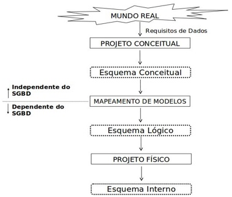

## [Tópico T25] - Modelo Entidade Relacionamento (MER) - Primeiros passos e _Checklist_
###### *by Prof. Plinio Sa Leitao-Junior (INF/UFG)*

**Modelos de dados** promovem a percepção abstrata em níveis para o banco de dados. Nesse sentido, cada modelo de dados se refere a um nível de abstração próprio, para guiar a criação e a evolução de um esquema de banco de dados. A figura a seguir apresenta níveis de abstração para os vários esquemas de um mesmo banco de dados.

O **Modelo Entidade Relacionamento (MER)** é comumente aplicado na etapa *projeto conceitual do banco de dados*. O projeto conceitual lida com a *especificação conceitual do banco de dados* (**esquema conceitual**), que é uma representação em uma abstração de alto-nível nível, cujo entendimento é mais próximo de usuários não especializados.

O **projeto conceitual** pelo emprego do **MER** busca abstrair uma **coleção de elementos conceituais** pertinentes aos dados. Essa abstração de elementos conceituais envolve o entendimento das responsabilidades informacionais próprias do banco dados. Cada desses elementos conceituais é inicialmente classificado como **[tipo de] entidade**, **[tipo de] relacionamento entre entidades** ou **atributo**. O processo evolui de forma iterativa e incremental, potencialmente com alterações na classificação inicial, até que amadureça uma representação conceitual do banco de dados, ou seja, um esquema conceitual.

Não é trivial determinar como um elemento conceitual do mundo real será tratado no MER. Dois projetistas distintos podem ter percepções conceituais diferentes sobre o banco de dados de uma aplicação. Então, **precisamos praticar bastante** para aos poucos ganhar maturidade. É um trabalho contínuo, um **bom projetista** sabe que este trabalho nunca terminará.

Algumas questões pertinentes são:
- Como saber **se um dado elemento conceitual é relevante** para o projeto conceitual pelo emprego do MER? Ou seja, esse elemento conceitual deve ser considerado no âmbito do projeto do banco de dados?
- Se o elemento conceitual for relevante, **como classificá-lo** em [tipo de] entidade, [tipo de] relacionamento entre entidades ou atributo? Ou seja, há critério que apoie essa classificação?

O produto do MER – esquema conceitual – pode ser representado por um diagrama, denominado **Diagrama Entidade Relacionamento (DER)**. O DER possui muitas notações, algumas muito conhecidas, tais com as três apresentadas na figura abaixo. O importante é que todas as notações representam as mesmas ideias. Na figura há dois tipos de entidade (DEPARTAMENTO e EMPREGADO) e um tipo de relacionamento (LOTAÇÃO). 

Ao ler e reler os três diagramas - Diagramas (a), (b) e (c) na figura - você consegue concluir a seguinte interpretação para o tipo de relacionamento LOTAÇÃO: "*um departamento possui de zero a N empregados lotados, um empregado sempre está lotado em um único departamento*"?

### _Checklist_

Vimos que um **modelo de dados** é uma ***coleção de conceitos*** que podem ser usados para descrever a estrutura de um banco de dados, relacionamentos de dados, semântica de dados e restrições de consistência.

Para o Modelo Entidade Relacionamento (MER), um *checklist* com a maioria dos conceitos deste modelo é apresentado abaixo.

1. Modelo Entidade-Relacionamento (ER), Diagrama ER, Unified Modeling Language (UML)
1. Requisitos de dados, Requisitos de software
1. Esquema conceitual de banco de dados, Projeto conceitual de banco de dados
1. Projeto lógico de banco de dados (ou mapeamento dentre modelos de dados), Projeto físico de banco de dados
1. Entidade, Relacionamento, Atributo
1. Tipo de entidade, Entidade, Instância de entidade
1. Tipo de relacionamento, Relacionamento, Instância de relacionamento
1. Atributo, Domínio de atributo
1. Atributo com valor requerido, Atributo sem valor requerido, Atributo chave
1. Atributo com valor repetível, Atributo valor não repetível, Atributo chave
1. Atributo Simples, Atributo composto
1. Atributo monovalorado, Atributo multivalorado
1. Atributo com valor armazenado, Atributo com valor derivado
1. Valor nulo, Valor não nulo
1. Grau binário de um tipo de relacionamento, Grau ternário de um tipo de relacionamento, Grau **N** de um tipo de relacionamento
1. Tipo de relacionamento recursivo, Tipo de relacionamento não recursivo
1. Restrição de participação total, Restrição de participação parcial
1. Restrição de Cardinalidade: 1:1 , 1:N , N:N
1. Tipo de entidade fraca, Tipo de relacionamento de identificação
1. Atributo de entidade, Atributo de relacionamento
1. Especialização exclusiva, especialização não exclusiva
1. Generalização parcial, generalização total

>Para que que haja melhor fluência no emprego do MER, é pertinente e importante que entendamos **todos** os conceitos presentes no ***checklist* de conceitos** do MER, apresentado acima.

Esses conceitos serão empregados nos próximos tópicos. Contudo, desde já é mandatório que sejam lidos e estudados os Capítulos 7 e 8 do livro sugerido[1].

### Elementos Relevantes X Tipo de Entidade X Tipo de Relacionamento X Atributo

Ao empregar o Modelo Entidade Relacionamento (MER) no projeto conceitual do banco de dados, é necessário **identificar os elementos relevantes pertinentes ao banco de dados (em estudo/análise)**, a partir dos requisitos de dados da aplicação. Sobre tais elementos relevantes, algumas questões são preeminentes:
1. Que elementos relevantes são categorizados como **tipo de entidade**?
1. Que elementos relevantes são categorizados como **tipo de relacionamento**?
3. Que elementos relevantes são categorizados como **atributos**?
4. Que **regras de integridade** permeiam os elementos relevantes?

>A aplicação do MER no projeto conceitual de banco de dados requer a **descoberta dos elementos relevantes e sua classificação**, a saber: *tipo de entidade*, *tipo de relacionamento*, *atributo* e *restrição de integridade*. Essa classificação dar-se-á com melhorias sucessivas, pois trata-se de um processo:
>- **Interativo.** Comunicação frequente entre projetistas, usuários e demais *stakeholders*.
>- **Iterativo.** Várias *rodadas* de desenvolvimento em grupo, com resultados intermediários e *feedbacks*.
>- **Evolutivo.** O esquema conceitual em si amadurece em decorrência da interação e da iteração.

Nosso curso envolve os primeiros esforços para: (i) o desenvolvimento de projeto conceitual de banco de dados; e (ii) o desenvolvimento de um projetista de banco de dados (o discente). O primeiro somente ocorre se o segundo ocorrer.

### Alguns dos conceitos postos no _Checklist_ ...

Alguns dos conceitos do MER são apresentados a seguir. Vale ressaltar que o aprendizado do MER para o projeto conceitual de banco de dados envolve o exercício prático de seus conceitos. 

- **Tipo de Entidade.** Elemento (coisa ou objeto) do mundo real com existência própria (independente). Todo tipo de entidade possui um **significado**; por exemplo, o tipo de entidade FUNCIONARIO no *BD Empresa* significa **o conjunto de funcionários** da empresa. Os tipos de entidade podem ser classificados como:
  - física: PESSOA, CARRO, CASA, FUNCIONARIO;
  - conceitual: COMPANHIA, PROFISSÃO, CURSO.
- **Entidade.** Uma instância de um tipo de entidade. Por exemplo, o 'José da Silva' e um particular 'fusca' são exemplos de entidades dos tipos PESSOA e CARRO, respectivamente.
- **Atributos [de Tipo de Entidade].** Propriedades particulares que contribuem para descrever um tipo de entidade. O tipo de entidade FUNCIONARIO é descrito pelos atributos *Nome*, *Data de Nascimento*, *Endereço*, *Salário* e *Cargo*. Uma particular entidade terá um valor para cada um de seus atributos. 
- **Domínio de Atributo.** Conjunto de valores possíveis de um atributo. Dois exemplos são: *(i)* o domínio do atributo *Estado civil* é **dom(Estado Civil) = &#123;"solteiro", "casado", ...&#125;**; e *(ii)* o domínio do atributo *Nome* do Tipo de Entidade FUNCIONARIO é **dom(FUNCIONARIO.Nome) = conjunto de cadeias de caracteres alfabéticos separados por caracteres em branco, e limitados a 40 caracteres**.
- **Valor Nulo.** Valor ausente, ou seja, nenhum valor foi atribuído ao atributo, pois o valor é desconhecido ou não aplicável. Um exemplo para o primeiro é: o valor do atributo *Data de Nascimento* não é conhecido para o 'José da Silva', o qual é uma entidade do tipo FUNCIONARIO. Um exemplo para o segundo é: o valor do atributo *Data de Pagamento* não é aplicável para uma particular fatura, que é uma entidade do tipo FATURA, pois a mesma ainda não foi paga. 
- **Atributo Composto.** Atributo que pode ser subdividido em subpartes menores, que representam atributos mais básicos, os quais possuem significados independentes. Por exemplo, o atributo *Endereço* pode ser subdividido em *Logradouro*, *Número*, *Complemento*, etc. Os atributos que não são divisíveis são chamados de **atributos simples** ou **atributos atômicos**. O valor de um atributo composto é a concatenação dos valores dos seus atributos simples (os atributos simples que o compõe). Atributos compostos são aplicáveis para *modelar situações em que o atributo composto é referenciado como uma unidade, mas seus componentes individuais são também referenciados em outras situações*.
- **Atributo Multivalorado.** Atributo que pode assumir, concomitantemente, vários valores para uma mesma entidade. Para ilustrar, o projetista de banco de dados concluiu que é importante 'conhecer' os vários números de telefone celular dos funcionários da empresa, especialmente aqueles ligados às atividades de vendas. Então, o projetista modelou o atributo *Número do Telefone Celular* como um atributo multivalorado. Então, uma dada uma entidade do tipo FUNCIONARIO (por exemplo o 'José da Silva') poderá ter seus 'vários' números de telefone celular presentes no banco de dados. 
- **Atributo Derivado.** Atributo cujo valor pode ser derivado a partir de outros componentes do esquema conceitual e, por isso, não necessitam ser armazenados no banco de dados (mas podem ser armazenados). Dois exemplos são: (i) o atributo *Idade* é um atributo derivado, pois seu valor pode ser obtido a partir do valor do atributo *Data de Nascimento*; e (ii) o atributo *Número de Dependentes* em FUNCIONARIO é um atributo derivado, pois seu valor pode ser obtido a partir da associação DEPENDENTES_DE (tipo de relacionamento) entre FUNCIONARIO e DEPENDENTE (tipos de entidade).
- **Atributo Chave.** Atributo (ou conjunto de atributos) que identifica cada entidade de um certo tipo. **Todo tipo de entidade tem um atributo chave**:
  - um exemplo, o atributo chave do tipo de entidade VEICULO é o atributo *Placa*;
  - outro exemplo, o atributo chave de MUNICIPIO é composto pelos atributos *Nome da Cidade* e *Estado*;
  - os valores do atributo chave são requeridos (não podem ser nulos) e únicos (não há repetição) dentre as entidades do Tipo de Entidade; por exemplo, duas entidades do tipo VEICULO não podem ter o mesmo valor para o atributo *Placa*.
  - podem existir vários atributos candidatos para ser o atributo chave, mas um deles deve ser o escolhido; por exemplo, os atributos *Placa*, *Renavam* e *Chassi* são candidatos em VEICULO.
  - o atributo chave deve ser mínimo, ou seja, não pode haver atributos 'supérfluos' para efeito de ser chave; por exemplo, o atributo chave de MUNICIPIO não precisaria ser composto pelos atributos *Nome da Cidade*, *Estado* e *Área*, pois somente os atributos *Nome da Cidade* e *Estado* são suficientes (o atributo *Área* seria supérfluo).
- **Tipo de Relacionamento.** Associação entre Tipos de Entidade. Todo tipo de relacionamento possui um **significado**; por exemplo, o tipo de relacionamento TRABALHA_PARA, que associa FUNCIONARIO e DEPARTAMENTO, significa que **funcionario trabalha para departamento**:
  - um tipo de relacionamento **R** entre **n** tipos de entidade **E1, E2, ..., En** define um conjunto de associações entre entidades desses tipos;
  - **n** representa o *grau do tipo de relacionamento*: se **n=2** então **R** é um *tipo de relacionamento binário*, se **n=3** então **R** é um *tipo de relacionamento ternário*; e assim por diante;
  - os tipos de relacionamento binários são os mais usuais.
- **Relacionamento.** Ocorrência (instância) de um tipo de relacionamento. Por exemplo, *o funcionário João da Silva trabalha para o departamento Recursos Humanos* é um relacionamento (uma instância de relacionamento) do tipo TRABALHA_PARA. Então, TRABALHA_PARA é um conjunto de relacionamentos (conjunto de instâncias de relacionamentos) entre FUNCIONARIO e DEPARTAMENTO , com o significado **funcionario trabalha para departamento**.
- **Atributos [de Tipo de Relacionamento].** Propriedades particulares que contribuem para descrever um tipo de relacionamento. Por exemplo, o tipo de relacionamento TRABALHA_EM, que associa FUNCIONARIO e PROJETO, possui o atributo *Horas*, o qual tem o significado **a quantidade de horas semanais que um funcionário trabalha em um projeto**. Veja que este atributo não é um atributo do tipo de entidade FUNCIONARIO, nem de PROJETO, mas um atributo da associação entre FUNCIONARIO e PROJETO, conforme o seu significado (ou seja, um atributo do tipo de relacionamento TRABALHA_EM). Um particular relacionamento terá um valor para cada um de seus atributos.
- **Restrição de Cardinalidade [em Tipo de Relacionamento].** Número máximo de instâncias de um tipo de relacionamento que uma entidade pode participar. Em tipos de relacionamento binários, as retrições de cardinalidade são **um-para-um (1:1)**, **um-para-muitos (1:N)** ou **muitos-para-muitos (N:N ou N:M)**. Por exemplo, no tipo de relacionamento TRABALHA_PARA, **a restrição de cardinalidade de DEPARTAMENTO:FUNCIONARIO é 1:N**, cujo significado é:
  - *cada departamento pode ter até (no máximo) vários funcionários que trabalham para ele*; e 
  - *cada funcionário trabalha para no máximo 1 (um) departamento*. 
- **Restrição de Participação [em Tipo de Relacionamento].** Número mínimo de instâncias de um tipo de relacionamento que uma entidade pode participar. Noutras palavras, se a existência de uma entidade depende de ela estar relacionada a outra entidade por meio do tipo de relacionamento. Uma restrição de participação pode ser **parcial** (o valor mínimo é zero, ou seja, uma entidade [de um certo tipo de entidade] pode participar ou não participar de um tipo de relacionamento) ou **total** (o valor mínimo é um, ou seja, toda entidade [de um certo tipo de entidade] deve participar de um tipo de relacionamento). Por exemplo, no tipo de ralacionamento GERENCIA, **FUNCIONARIO tem participação parcial** e **DEPARTAMENTO tem participação total**, cujo significado, respectivamente, é:
  - *pode haver funcionários que são gerentes de departamento, mas pode haver funcionários que não são gerentes de departamento*; e 
  - *todo e qualquer departamento está associado a pelo menos (no mínimo) um funcionário, que é o seu gerente*.

### Uma Notação para o Diagrama Entidade Relacionamento (DER)

Os conceitos do Modelo Entidade Relacionamento (MER) podem ser empregados para especificar o Diagrama Entidade Relacionamento (DER), que é uma **representação visual** do **esquema conceitual** do banco de dados. A seguir é introduzida uma notação para o DER, conforme posta em [1].

>***Questão:* Você consegue identificar e interpretar os conceitos do MER presentes no DER do BD Empresa (diagrama a seguir)?**
>

### Exercício

Considere o diagrama a seguir:

Analise as 05 questões abaixo.

1. Qualquer empréstimo está associado a no mínimo um cliente e a no mínimo uma agência? (Responda Sim ou Não)
1. Uma agência realiza de zero a vários empréstimos, e um empréstimo ocorre em uma e somente uma agência? (Responda Sim ou Não)
1. Um banco possui de zero a várias agências, e uma agência está associada a um e somente um banco? (Responda Sim ou Não)
1. Um cliente requisita de zero a vários empréstimos, e um mesmo empréstimo ocorre para um e somente um cliente? (Responda Sim ou Não)
1. Qualquer conta está associada a no mínimo um cliente e a no mínimo uma agência? (Responda Sim ou Não)
   
### Bibliografia

[1] ELMASRI, R.; NAVATHE, S. B. Sistemas de Banco de Dados. 6. ed. Pearson, 2011.
