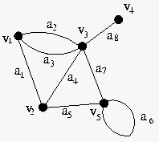
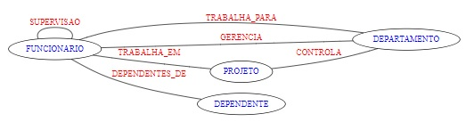

## [Tópico T26] - Modelo Entidade Relacionamento (MER) - Demanda informacional
###### *by Prof. Plinio Sa Leitao-Junior (INF/UFG)*

O **projetista do banco de dados** toma várias decisões durante o **projeto conceitual**, baseando-se nos **requisitos de dados**. Certamente, o projetista participa de várias iterações para a análise e para a evolução do **esquema conceitual**. Possivelmente, o projetista se depara com vários *pontos de imprecisão*, tais como aqueles listados para a atividade do [Tópico 03](./topico-03.md). 

O **projeto conceitual** do banco de dados envolve o emprego de um modelo de alto-nível, para a especificação do **esquema conceitual** do banco de dados. Nossa ementa adota o Modelo Entidade Relacionamento (MER) para guiar o **projeto conceitual**. 

### Requisitos de dados - BD Empresa

Retomemos os requisitos do BD Empresa[1], que estão transcritos a seguir.

>*A empresa é organizada em departamentos. Cada departamento tem um nome exclusivo, um número exclusivo e um funcionário em particular que o gerencia. Registramos a data inicial em que esse funcionário começou a gerenciar o departamento. Um departamento pode ter vários locais. 
Um departamento controla uma série de projetos, cada um deles com um nome exclusivo, um número exclusivo e um local exclusivo. 
Armazenamos o nome, número de Cadastro de Pessoa Física, endereço, salário, sexo (gênero) e data de nascimento de cada funcionário. Um funcionário é designado para um departamento, mas pode trabalhar em vários projetos, que não necessariamente são controlados pelo mesmo departamento. Registramos o número atual de horas por semana que um funcionário trabalha em cada projeto. Também registramos o supervisor direto de cada funcionário (que é outro funcionário). 
Queremos registrar os dependentes de cada funcionário para fins de seguro. Para cada dependente, mantemos o nome, sexo, data de nascimento e o parentesco com o funcionário.*

### Diagrama Entidade Relacionamento (DER)

**Quando se emprega o MER para o *projeto conceitual*, qual é a *especificação (representação) do esquema conceitual* do banco de dados?**

>O **Diagrama Entidade Relacionamento (DER)** é uma **representação visual** do **esquema conceitual** do banco de dados.

Com base nos **requisitos de dados** do BD Empresa, o seguinte Diagrama Entidade Relacionamento (DER)[1] foi produzido pelo **projetista do banco de dados**.

>**Cada elemento do DER - retângulo, losango, elipse - possui um significado particular.**

Nos exemplos abaixo são ressaltados: (i) o **significado particular de alguns dos elementos do DER** para o BD Empresa; (ii) a distinção entre **tipo de entidade** e **entidade**; e (iii) a distinção entre **tipo de relacionamento** e **relacionamento**.
- FUNCIONARIO é um **tipo de entidade**, cujo significado é **conjunto de funcionários** da empresa:
  - [ ] 'o *João da Silva*' é uma **entidade** do tipo FUNCIONARIO. 
- DEPARTAMENTO é um **tipo de entidade**, cujo significado é **conjunto de departamentos** da empresa:
  - [ ] '*Recursos Humanos*' é uma **entidade** do tipo DEPARTAMENTO.
- TRABALHA_PARA é um **tipo de relacionamento** binário que associa FUNCIONARIO e DEPARTAMENTO, cujo signicado é **funcionario trabalha para departamento**:
  - [ ] 'o *João da Silva trabalha para o departamento Recursos Humanos*' é um **relacionamento** do tipo TRABALHA_PARA.
- GERENCIA é um **tipo de relacionamento** binário que associa FUNCIONARIO e DEPARTAMENTO, cujo signicado é **funcionario gerencia departamento**:
  - [ ] 'a *Ana Lima gerencia o departamento Vendas*' é um **relacionamento** do tipo GERENCIA.

### Um pouco de grafos ...

Seja o Grafo **G = (V, A)**, onde:
- **G** é um grafo que modela algum aspecto do mundo-real;
- **V** é um conjunto de vértices;
- **A** é um conjunto de arestas;
- ***vi*** possui um significado particular, &#8704; ***vi* &#8712; *V***;
- ***ai*** possui um significado particular, &#8704; ***ai* &#8712; *A***.

A figura a seguir ilustra o grafo **G = ( &#123;v1, v2, v3, v4, v5&#125; , &#123;a1, a2, a3, a4, a5, a6, a7 a8&#125; )**. 
Observe na figura que cada aresta particular conecta dois vértices possivelmente distintos (exceto a aresta ***a6***).

>Essencialmente, **um subgrafo é um grafo dentro de um grafo maior**.

Formalmente, **G&#8727; = (V&#8727;, A&#8727;)** é um ***subgrafo*** de **G = (V, A)** se: 
- [ ] **V&#8727; &#8838; V**, ou seja, **V&#8727; é um subconjunto de V**, e
- [ ] **A&#8727; &#8838; A**, ou seja, **A&#8727; é um subconjunto de A**.

Para ilustrar, considere que o Grafo **G = ( &#123;v1, v2, v3, v4, v5&#125; , &#123;a1, a2, a3, a4, a5, a6, a7 a8&#125; )** possui os dois subgrafos:
- Se **G&#8727; = ( &#123;v1, v3, v4&#125; , &#123;a2, a8&#125; )**, então **G&#8727; é um subgrafo de G**.
- Se **G&#8727;&#8727; = ( &#123;v1, v3, v4&#125; , &#123;a3, a8&#125; )**, então **G&#8727;&#8727; é um subgrafo de G**.

>**Vale repetir que cada elemento de um grafo - vértice ou aresta - possui um significado particular.** 
>**Então, o conteúdo do grafo é a união dos significados particulares de seus vértices e arestas.**

Os grafos **G&#8727;** e **G&#8727;&#8727;** diferem entre si por uma única aresta (**a2** em vez de **a3**, e vice-versa). Como o **conteúdo de um grafo** é a união do significado particular de cada vértice e aresta, então o **conteúdo de G&#8727;** *é distinto* do **conteúdo de G&#8727;&#8727;**.

### Emprego de grafos ... no contexto do DER

>***A especificação por meio de um DER pode ser percebida como um grafo G = (V, A).***

A partir da analogia entre DER e grafos, conforme a figura acima, identificam-se os elementos:
- os **tipos de entidade** (os retângulos no DER) são os vértices do grafo;
- os **tipos de relacionamento** (os losangos no DER) são as arestas do grafo;
- os **atributos** (as elipses no DER) e **outras restrições** (os números (1 e N) e as linhas simples e duplas no DER) promovem o significado particular para cada vértice e aresta do grafo.

### Demanda informacional da aplicação

Sobre a adequação do esquema conceitual às demandas informacionais da aplicação, uma questão pertinente é:

>***Questão 01:* As demandas informacionais da aplicação são atendidas a partir do esquema conceitual especificado no DER?**  
>Noutras palavras, o projetista de banco de dados produziu um esquema conceitual capaz de atender a todas as demandas informacionais da aplicação? 

Por exemplo, o DER produzido para o BD Empresa **poderia ser avaliado** quanto ao atendimento às seguintes consultas:
- **Consulta 01:** Que funcionários trabalham para um particular departamento?
- **Consulta 02:** Quem é o gerente de cada departamento?
- **Consulta 03:** Que funcionários trabalham em um particular projeto?
- **Consulta 04:** Que funcionários possuem o maior número de dependentes?

A resposta à **Questão 01** perpasssa pela análise do esquema conceitual (representado pelo DER), para identificar **que subgrafos são *necessários* e *suficientes* para atender cada demanda informacional da aplicação**.

Para promover o entendimento, vamos considerar o grafo para o DER do BD Empresa:
- Grafo G = ( &#123;DEPARTAMENTO, DEPENDENTE, FUNCIONARIO, PROJETO&#125; , &#123;CONTROLA, DEPENDENTES_DE, GERENCIA, SUPERVISAO, TRABALHA_EM, TRABALHA_PARA&#125; )

Se uma demanda informacional pode ser atendida a partir do esquema conceitual do banco de dados, então existe pelo menos um subgrafo [do DER] cujo conteúdo é necessário e suficiente para o processamento da demanda. A seguir estão alguns subgrafos e exemplos de demandas informacionais atendidas pelos mesmos.
- **Subgrafo G&#8727; = ( &#123;DEPARTAMENTO, FUNCIONARIO&#125; , &#123;TRABALHA_PARA&#125; )**
  - [ ] Que funcionários trabalham para cada departamento?
  - [ ] Quantos funcionários trabalham para cada departamento?
  - [ ] Qual a média salarial de cada departamento?
- **Subgrafo G&#8727;&#8727; = ( &#123;DEPARTAMENTO, FUNCIONARIO&#125; , &#123;GERENCIA&#125; )**
  - [ ] Quem é o gerente de cada departamento?
  - [ ] Dentre os gerentes atuais, qual deles está mais tempo na gerência do departamento?
  - [ ] Qual a média salarial dos gerentes de departamento?
- **Subgrafo G&#8727;&#8727;&#8727; = ( &#123;FUNCIONARIO, PROJETO&#125; , &#123;TRABALHA_EM&#125; )**
  - [ ] Que funcionários trabalham em cada projeto?
  - [ ] Que funcionários trabalham em mais de um projeto?
  - [ ] Que projetos possuem mais de um funcionário que trabalha nele?
- **Subgrafo G&#8727;&#8727;&#8727;&#8727; = ( &#123;DEPENDENTE, FUNCIONARIO&#125; , &#123;DEPENDENTES_DE&#125; )**
  - [ ] Quais os dependentes de cada funcionários?
  - [ ] Quantos dependentes possuem cada funcionário?
  - [ ] Que funcionários possuem o maior número de dependentes?

>***Questão 02:* Os Subgrafos G&#8727; e G&#8727;&#8727;, apresentados acima, possuem o mesmo conjunto de vértices - &#123;DEPARTAMENTO, FUNCIONARIO&#125; - mas diferem em relação às arestas: TRABALHA_PARA e GERENCIA, respectivamente.** 
Por que as demandas informacionais atendidas por G&#8727; não podem ser atendidads por G&#8727;&#8727;, e vice-versa?

A resposta à **Questão 02** está atrelada ao significado de cada elemento dos subgrafos, especificamente as arestas TRABALHA_PARA e GERENCIA.

### Exercício

Seja o esquema conceitual do BD Empresa, que está representado por meio do DER apresentado acima. Avalie se as demandas informacionais abaixo podem ser atendidas pelo esquema conceitual.

1. Que projetos possuem gerentes de projeto que trabalham nesses projetos? (Responda Sim ou Não)
1. Qual o nome dos funcionários que não possuem dependentes? (Responda Sim ou Não)
1. Quantos funcionários aposentados existem na empresa ? (Responda Sim ou Não)
1. Que funcionários trabalham para um departamento que controla algum projeto que eles trabalham em? (Responda Sim ou Não)
1. Quais os gerentes de departamento que também são gerentes de projeto? (Responda Sim ou Não)
1. Qual o número médio de dependentes por empregado em cada departamento? (Responda Sim ou Não)

### Bibliografia

[1] ELMASRI, R.; NAVATHE, S. B. Sistemas de Banco de Dados. 6. ed. Pearson, 2011.
