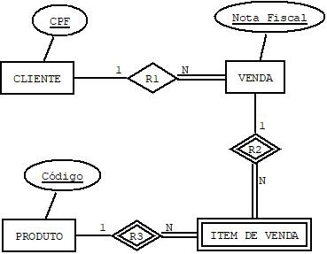

## [Tópico T28] - Modelo Entidade Relacionamento (MER) - Exercício
###### *by Prof. Plinio Sa Leitao-Junior (INF/UFG)*

Seja o diagrama abaixo, referente ao esquema conceitual a um _banco de dados de Vendas Online_:

### Reflexões 01

Responda as questões abaixo:
   - Qual a identificação (atributo chave) do tipo de entidade ITEM DE VENDA?
   - Um mesmo produto pode ser vendido várias vezes ao mesmo cliente?
   - Um item de venda se refere a um produto?

### Reflexões 02

Que alterações no esquema conceitual (DER) atendem às seguintes consultas:
   - Qual o valor vendido a cada cliente?
   - Qual o produto teve maior quantidade de itens vendidos em um dado período?
   - Qual o preço unitário de venda de cada produto na data em que o mesmo foi vendido?

&nbsp;&nbsp;&nbsp;&nbsp;&nbsp;&nbsp;&nbsp;&nbsp;[Uma Solução para Reflexões 02](./topico-28solucao-02.md)

### Reflexões 03

Responda as questões abaixo:
- Qual o significado do atributo **Preço unitário** em PRODUTO?
- Qual o significado do atributo **Preço unitário** em ITEM DE VENDA?
- Como saber o _valor total de uma venda_?

&nbsp;&nbsp;&nbsp;&nbsp;&nbsp;&nbsp;&nbsp;&nbsp;[Uma Solução para Reflexões 03](./topico-28solucao-03.md)

### Reflexões 04

Que alterações no esquema conceitual (DER) atendem às seguintes consultas:
- Quais as vendas integralmente pagas, sabendo que qualquer venda pode ser paga a prazo (em parcelas)?
- Quais as parcelas pagas de uma venda?
- Quais as parcelas não pagas de uma venda?

&nbsp;&nbsp;&nbsp;&nbsp;&nbsp;&nbsp;&nbsp;&nbsp;[Uma Solução para Reflexões 04](./topico-28solucao-04.md)

### Reflexões 05

Que alterações no esquema conceitual (DER) atendem às seguintes consultas:
- Quais o valor total das parcelas pagas e o valor total das parcelas não pagas de uma venda?
- Quais as parcelas pagas em atraso?
- Quais os juros cobrados nas parcelas pagas em atraso?

&nbsp;&nbsp;&nbsp;&nbsp;&nbsp;&nbsp;&nbsp;&nbsp;[Uma Solução para Reflexões 05](./topico-28solucao-05.md)

### Reflexões 06

Que alterações no esquema conceitual (DER) atendem às seguintes consultas:
- Qual o CPF, nome e data de nascimento dos clientes que compraram produtos da categoria 'Esporte e Lazer'?
- Quais os produtos que possuem pelo menos de 05 unidades em estoque?
- Quais os produtos vendidos que já foram entregues ao cliente (comprador)?
- Quais os produtos avaliados com 05 estrelas em um dado período?

&nbsp;&nbsp;&nbsp;&nbsp;&nbsp;&nbsp;&nbsp;&nbsp;[Uma Solução para Reflexões 06](./topico-28solucao-06.md)
