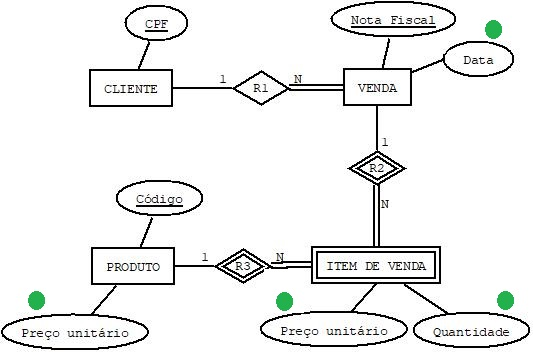

### Reflexões 02

Que alterações no esquema conceitual (DER) atendem às seguintes consultas:
   - Qual o valor vendido a cada cliente?
   - Qual o produto teve maior quantidade de itens vendidos em um dado período?
   - Qual o preço unitário de venda de cada produto na data em que o mesmo foi vendido?

