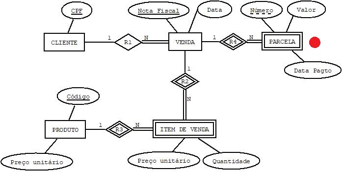

### Reflexões 04

Que alterações no esquema conceitual (DER) atendem às seguintes consultas:
- Quais as vendas integralmente pagas, sabendo que qualquer venda pode ser paga a prazo (em parcelas)?
- Quais as parcelas pagas de uma venda?
- Quais as parcelas não pagas de uma venda?

