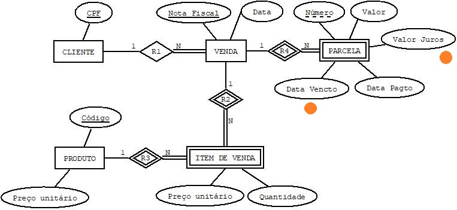

### Reflexões 05

Que alterações no esquema conceitual (DER) atendem às seguintes consultas:
- Quais o valor total das parcelas pagas e o valor total das parcelas não pagas de uma venda?
- Quais as parcelas pagas em atraso?
- Quais os juros cobrados nas parcelas pagas em atraso?

