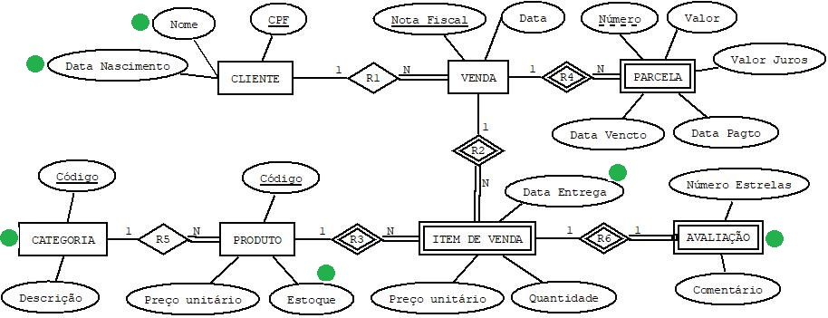

### Reflexões 06

Que alterações no esquema conceitual (DER) atendem às seguintes consultas:
- Qual o CPF, nome e data de nascimento dos clientes que compraram produtos da categoria 'Esporte e Lazer'?
- Quais os produtos que possuem pelo menos de 05 unidades em estoque?
- Quais os produtos vendidos que já foram entregues ao cliente (comprador)?
- Quais os produtos avaliados com 05 estrelas em um dado período?

