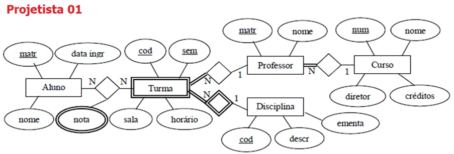
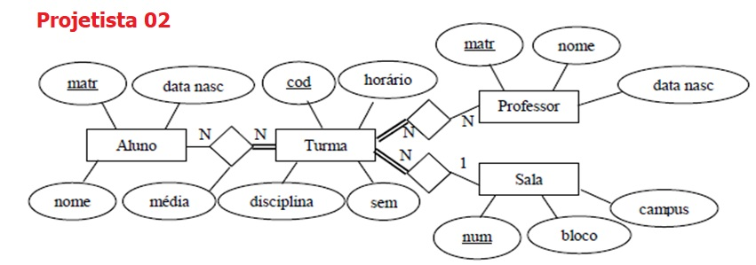
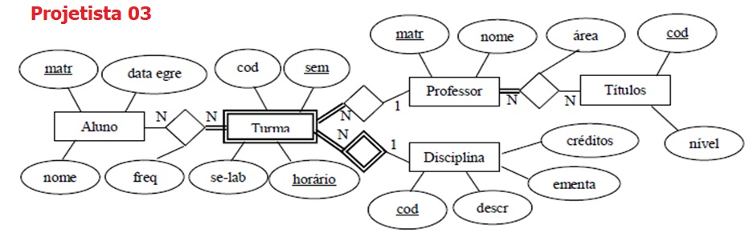

## [Tópico 29] - Modelo Entidade Relacionamento (MER) - Exercício
###### *by Prof. Plinio Sa Leitao-Junior (INF/UFG)*

Três projetistas de banco de dados - Projetista 01, Projetista 02 e Projetista 03 - foram contratados para elaborar o esquema conceitual segundo o Modelo Entidade Relacionamento, referente ao banco de dados de uma universidade: **BD Universidade**, conforme ilustrado nas figuras abaixo.

### Observações pertinentes

- Os atributos **data ingr** e **data egre** referem-se à data de ingresso e de egresso do aluno na instituição.
- O atributo **sem** refere-se ao semestre (e ano) em que uma turma é oferecida.
- O atributo **freq** refere-se à frequência de um aluno em uma turma.
- O tipo de entidade **Títulos** refere-se às titulações de cada professor; por exemplo, nível mestrado.
- O atributo **se-lab** indica se a turma possui aulas de laboratório.
- O atributo **horário** determina o horário (e o dia da semana) para a turma.
- O atributo **créditos** em **Disciplina** refere-se ao número de horas semanais para uma disciplina.
- O atributo **créditos** em **Curso** refere-se ao número mínimo de horas para um curso.
- Para ser aprovado, um aluno deve ser aprovado por frequência e por média.
- Um aluno é reprovado por média, se a média aritmética de notas for inferior a 7,0 (sete vírgula zero).
- Um aluno é reprovado por frequência, se a frequência for inferior a 75% (setenta e cinco por cento).

### Demandas informacionais solicitadas pelo controle acadêmico 

1. Relação de professores que possuem mestrado ou doutorado.
1. Os professores que possuem turma com aulas de laboratório em um semestre.
1. A quantidade de turmas oferecidas em um semestre.
1. O código e ementa das disciplinas com turma oferecida em um semestre.
1. A carga horária de cada professor em um semestre.
1. As turmas oferecidas em um determinado semestre, apresentando horário e sala.
1. A quantidade de créditos das aprovações de cada aluno.
1. A idade que os alunos tinham quando ingressaram na instituição.
1. A idade que os professores tinham quando ingressaram na instituição.
1. A quantidade de reprovações por média de cada aluno.
1. A quantidade de reprovações por frequência de cada aluno.
1. A relação de professores que obtiveram doutorado em 2002.
1. Para cada professor, a quantidade de turmas oferecidas em laboratório.
1. A ementa das disciplinas com turmas oferecidas em um semestre para um certo professor.
1. Para cada aluno, os professores de suas turmas em um semestre.
1. O nome e matrícula dos alunos das turmas oferecidas em um semestre.
1. O nome e matrícula dos alunos das turmas oferecidas em um bloco de um campus.
1. A matrícula e nome de um professor, e o diretor do curso em o professor está associado.
1. A data de aniversário de cada professor.
1. A data de aniversário de cada diretor de curso.

### Requisitos estruturais

1. Uma turma pode existir sem alunos, mas não pode existir sem professor.
1. Toda turma possui no máximo um professor, não existindo turma sem professor.
1. O atributo cod do tipo de entidade Turma possui restrição unicidade de dados.
1. Duas turmas podem ser oferecidas de uma mesma disciplina, em um mesmo semestre e em um  mesmo horário.
1. Um mesmo aluno pode possuir diversas turmas de um mesmo professor em um mesmo semestre.
1. Um mesmo professor pode possuir vários telefones.
1. Um aluno pode não estar matriculado em que qualquer turma em um determinado semestre.
1. Turma é um tipo entidade fraca que depende do professor para sua identificação.
1. Não existe professor sem qualquer turma associada.
1. Uma turma pode existir mesmo sem nenhum aluno associado.

### Exercícios

1. Quais as demandas informacionais atendidas pelos esquemas conceituais elaborados pelo Projetista 01, pelo Projetista 02 e pelo Projetista 03?
1. Quais os requisitos estruturais cumpridos pelos esquemas conceituais elaborados pelo Projetista 01, pelo Projetista 02 e pelo Projetista 03?
