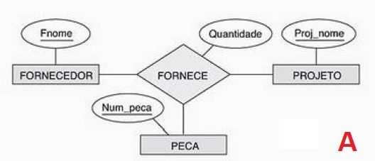
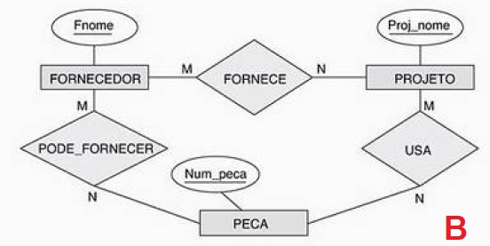
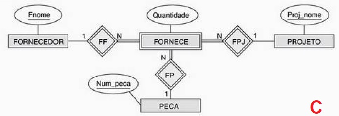

## [Tópico 34] - Exercício
###### *by Prof. Plinio Sa Leitao-Junior (INF/UFG)*

Sejam os três diagramas abaixo, tente abstrair as distinções entre esses diagramas.

### Exercício 01
Os diagramas são equivalentes entre si? Reflita sobre o conteúdoe propósito de cada dos diagramas.
