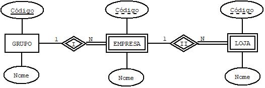

## [Tópico T35] - Mapeamento MER para MR (parte 1)
###### *by Prof. Plinio Sa Leitao-Junior (INF/UFG)*

O conteúdo apresentado usa o esquema conceitual do **BD Empresa**, conforme abaixo.


### Projeto de Banco de Dados:<br>É possível obter um _esquema lógico_ a partir de um _esquema conceitual_?

>Refraseando no escopo da nossa ementa:<br>
Como obter um _**esquema segundo o Modelo Relacional**_ a partir de um _**esquema segundo o Modelo Entidade Relacionamento**_?

**A resposta perpassa pelo estudo da estrutura e significado das construções (conceitos) presentes no esquema conceitual para, então, decidir como representar cada construção em nível lógico**:<br>■ Construções em nível conceitual são "transformadas" em construções em nível lógico.

```diff
@@ Contudo, não há correspondência biunívoca entre construções em níveis conceitual e lógico @@
+ Uma construção em nível conceitual pode resultar em várias alternativas em nível lógico.
- Uma construção em nível lógico pode advir de distintas construções em nível conceitual.
```

### Projeto de Banco de Dados:<br>Há diretrizes que guiam o mapeamento entre o esquema conceitual e o esquema lógico?

#### Algumas diretrizes gerais:
- Alcançar boa performance no uso de recursos computacionais, tal como reduzir tempo de processamento de operações de banco de dados.
- Simplificar o desenvolvimento, tal como promover consultas SQL mais simples.

#### Algumas diretrizes específicas:
- **Diminuir o número de chaves**:
  - SGBDs usam índices para a implementação de chaves primárias;
  - Índices tendem a ocupar espaço não trivial (considerável), em memória e em disco;
  - A inserção e a remoção de entradas (registros) de um índice podem exigir acessos a disco, o que degrada o tempo processamento de operações;
  - Solução: usar implementações com número menor de chaves:
    - Por exemplo, preferir (somente 01 chave) ...<br>&#9786; CLIENTE (CodCliente, Nome, NomeContato, Endereco, Telefone)<br>&#9786; **CLIENTE (CodCliente) IS PRIMARY KEY**<br>em vez de (02 chaves) ...<br>&#9785; CLIENTE (CodCliente, Nome, NomeContato)<br>&#9785; **CLIENTE (CodCliente) IS PRIMARY KEY**<br>&#9785; CLIENTE_ENDER (CodCliente, Endereco, Telefone)<br>&#9785; **CLIENTE_ENDER (CodCliente) IS PRIMARY KEY**<br>&#9785; CLIENTE_ENDER (CodCliente) REFERENCES CLIENTE (CodCLiente)
- **Reduzir ou evitar junções**:
  - Junção pode envolver diversos acessos a disco:
    - SGBD relacional idealmente armazena os dados de uma _tupla_ contiguamente em disco;
  - É preferível ter os dados necessários a uma consulta em uma única _tupla_.
- **Evitar atributos com valores opcionais**:
  - A presença de valores nulos pode agregar complexidade às expressões SQL.
  - O desenvolvedor preciar maior atenção para aplicar:
    - predicados do tipo IS NULL e IS NOT NULL;
    - funções que detectam a presença de valores nulos, tal como ISNULL.

### Projeto de Banco de Dados:<br>Há regras para obter um _esquema lógico_ a partir de um _esquema conceitual_?

Sim.<br>
**Cada elemento conceitual representado impacta a decisão sobre as construções lógicas derivadas.**

Introduziremos tais regras a seguir:
- As regras preferidas (adequadas à maioria dos casos) são usualmente utilizadas por ferramentas de banco de dados.

### Regra 01 - Mapeamento de Tipo de Entidade Regular

Para cada tipo de entidade regular (tipo de entidade não-fraca) **E** no esquema conceitual (esquema ER), criar um esquema de relação **T**:
- Incluir em **T** todos os atributos simples presentes em E:
  - atributos simples são atributos ao mesmo tempo monovalorados, não-compostos e não-derivados.
- No caso de atributos compostos, incluir em **T** somente os atributos simples que fazem parte de atributos compostos presentes em E.
- Escolha um dos atributos-chave candidatos de E para ser a chave primária de **T**:
  - se o candidato escolhido for um atributo composto, então a chave primária de **T** é formada pelos atributos simples que fazem parte do atributo composto;
  - é pertinente reter o conhecimento sobre quais são os atributos-chave candidatos de E, para fins de indexação e outros tipos de análises.

Sobre o BD Empresa, a aplicação desta regra resulta em (_realce em **negrito**_):
|Esquema de relação|
|-|
|**FUNCIONARIO (Pnome, Minicial, Unome, Cpf, Datanasc, Endereco, Sexo, Salario)<br>FUNCIONARIO (Cpf) IS PRIMARY KEY**|
|**DEPARTAMENTO (Dnome, Dnumero)<br>DEPARTAMENTO (Dnumero) IS PRIMARY KEY**|
|**PROJETO (Projnome, Projnumero, Projlocal)<br>PROJETO (Projnumero) IS PRIMARY KEY**|

### Regra 02 - Mapeamento de Tipo de Entidade Fraca

Para cada tipo de entidade fraca **W** no esquema conceitual (esquema ER), criar um esquema de relação **S**:
- Incluir em S todos os atributos simples (ou componentes simples de atributos compostos) presentes em W.
- Incluir em S os atributos de chave estrangeira que referenciam à chave primária dos tipos de entidade proprietária de W:
  - tipo de entidade proprietária de W é aquela que está associada a W por meio de um tipo de relacionamento de identificação;
  - os atributos de chave estrangeira incluídos em R mapeiam os tipos de relacionamento de identificação de W;
  - W pode ter um ou mais tipos de entidade proprietária.
- A chave primária de S é a combinação das chaves estrangeiras (que referenciam à chave primária dos tipos de entidade proprietária de W) e a chave parcial de W (se existir chave parcial de W).

Sobre o BD Empresa, a aplicação desta regra resulta em (_realce em **negrito**_):
|Esquema de relação|
|-|
|FUNCIONARIO (Pnome, Minicial, Unome, Cpf, Datanasc, Endereco, Sexo, Salario)<br>FUNCIONARIO (Cpf) IS PRIMARY KEY|
|DEPARTAMENTO (Dnome, Dnumero)<br>DEPARTAMENTO (Dnumero) IS PRIMARY KEY|
|PROJETO (Projnome, Projnumero, Projlocal)<br>PROJETO (Projnumero) IS PRIMARY KEY|
|**DEPENDENTE (Fcpf, Nome_dependente, Sexo, Datanasc, Parentesco)<br>DEPENDENTE (Fcpf, Nome_dependente) IS PRIMARY KEY<br>DEPENDENTE (Fcpf) REFERENCES FUNCIONARIO (Cpf)**|

Se houver um tipo de entidade fraca E2 cujo tipo de entidade proprietária também é um tipo de entidade fraca E1, então E1 deve ser mapeado antes de E2 para determinar primeiro a sua chave primária:
- Seja o DER a seguir, com dois tipos de entidade fraca, em que EMPRESA é o tipo de entidade proprietária de LOJA.



- O esquema lógico referente ao DER é mostrado abaixo.

|Esquema de relação|
|-|
|GRUPO (CodigoG, Nome)<br>GRUPO (CodigoG) IS PRIMARY KEY|
|EMPRESA (CodigoG, CodigoE, Nome)<br>EMPRESA (CodigoG, CodigoE) IS PRIMARY KEY<br>EMPRESA (CodigoG) REFERENCES GRUPO (CodigoG)|
|LOJA (CodigoG, CodigoE, CodigoL, Nome)<br>LOJA (CodigoG, CodigoE, CodigoL) IS PRIMARY KEY<br>LOJA (CodigoG, CodigoE) REFERENCES EMPRESA (CodigoG, CodigoE)<br>~~LOJA (CodigoG) REFERENCES GRUPO (CodigoG)~~|
