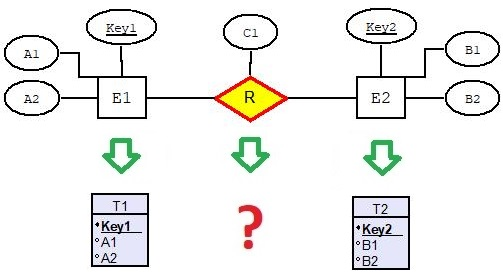
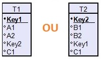
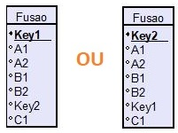
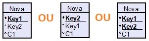

## [Tópico T36] - Mapeamento MER para MR (parte 2)
###### *by Prof. Plinio Sa Leitao-Junior (INF/UFG)*

O conteúdo apresentado usa o esquema conceitual do **BD Empresa**, conforme abaixo.

### Mapeamento de Tipo de Relacionamento Binário

Seja o tipo de relacionamento binário **R** no esquema conceitual (esquema ER), conforme a figura abaixo:
- **E1** e **E2** são os tipos de entidade que participam de **R**.
- **T1** e **T2** corrspondem às relações mapeadas a partir de **E1** e **E2**, respectivamente.

> Pergunta: Como mapear o tipo de relacionamento **R** para o modelo relacional?
>> Resposta: As decisões de projeto em nível conceitual impactam na forma como o mapeamento é executado.

Por exemplo, a restrição de participação (parcial ou total) e a restrição de cardinalidade (1:1, 1:N ou M:N) guiam as decisões em nível lógico (deccisões para o modelo relacional).

Em geral, **há três abordagens** de mapeamento possíveis:
- **Abordagem de chave estrangeira**:
  - O tipo de relacionamento é mapeado pela inclusão de uma chave estrangeira na relação **T1** ou na relação **T2**:
    - por exemplo, considere que a chave estrangeira foi inserida em **T1**;
    - então, a chave estrangeira em **T1** referencia a chave primária de **T2**;
    - incluir na relação **T1** todos os atributos simples (ou componentes simples de atributos compostos) do tipo de relacionamento **R**.

- **Abordagem de fusão de relações**:
  - O tipo de relacionamento é mapeado pela fusão das relações **T1** e **T2**:
    - a _relação de fusão_ substitui **T1** e **T2**;
    - a _relação de fusão_ terá todos os atributos de **T1** e de **T2**;
    - a _relação de fusão_ terá como chave primária e chave primária de **T1** ou a chave primária de **T2**.
  - Incluir na _relação de fusão_ todos os atributos simples (ou componentes simples de atributos compostos) do tipo de relacionamento **R**.

- **Abordagem de criação de relação**:
  - O tipo de relacionamento é mapeado pela criação de uma nova relação:
    - a _nova relação_ possui duas chaves estrangeiras:
      - uma chave estrangeira referencia a chave primária de **T1**; e
      - uma chave estrangeira referencia a chave primária de **T2**.
    - incluir na _nova relação_ todos os atributos simples (ou componentes simples de atributos compostos) do tipo de relacionamento **R**.
  - Abordagem que promove o aumento de **junções**:
    - uma junção extra é requerida quando combina _tuplas_ (junção) de **T1** e **T2**.

### Regra 03 - Mapeamento de Tipo de Relacionamento Binário 1:1

|Abordagem|Comentário|
|-|-|
|**Chave estrangeira**|Alternativa em geral preferida. Sobre a decisão para incluir a chave estrangeira em **T1** ou em **T2**: &#9745; preferir a relação que corresponde ao tipo de entidade (**E1** ou **E2**) com participação total em **R**; &#9728; se ambos **E1** ou **E2** têm participação parcial, preferir a relação com menor número de _tuplas_.|
|**Fusão de relações**|Alternativa possível quando ambos os tipos de entidade (**E1** ou **E2**) têm participação total em **R**: &#9745; as duas relações - **T1** e **T2** - terão exatamente o mesmo número de _tuplas_, &nbsp;&nbsp;&nbsp;&nbsp;&nbsp;&nbsp;em todos os momentos.|
|**Criação de relação**|A chave primária da nova relação será uma das chaves estrangeiras: &#9745; a chave estrangeira referencia a chave primária de **T1**; OU &#9745; a chave estrangeira referencia a chave primária de **T2**.|

Sobre o BD Empresa, a aplicação desta regra resulta em (_realce em **negrito**_):
|Esquema de relação|
|-|
|FUNCIONARIO (Pnome, Minicial, Unome, Cpf, Datanasc, Endereco, Sexo, Salario) FUNCIONARIO (Cpf) IS PRIMARY KEY|
|DEPARTAMENTO (Dnome, Dnumero, **Cpf_gerente**, **Data_inicio_gerente**) DEPARTAMENTO (Dnumero) IS PRIMARY KEY **DEPARTAMENTO (Cpf_gerente) REFERENCES FUNCIONARIO (Cpf)**|
|PROJETO (Projnome, Projnumero, Projlocal) PROJETO (Projnumero) IS PRIMARY KEY|
|DEPENDENTE (Fcpf, Nome_dependente, Sexo, Datanasc, Parentesco) DEPENDENTE (Fcpf, Nome_dependente) IS PRIMARY KEY DEPENDENTE (Fcpf) REFERENCES FUNCIONARIO (Cpf)|

### Regra 04 - Mapeamento de Tipo de Relacionamento Binário 1:N

|Abordagem|Comentário|
|-|-|
|**Chave estrangeira**|Alternativa em geral preferida. **(1)** Identificar a relação (**T1** ou **T1**) que corresponde ao tipo de entidade (**E1** ou **E1**) que representa o tipo de entidade no lado **N** do tipo de relacionamento **R**. &#9745; Se a relação identificada for **T1**, incluir em **T1** uma chave estrangeira que referencia a chave primária de **T2**. &#9745; Se a relação identificada for **T2**, incluir em **T2** uma chave estrangeira que referencia a chave primária de **T1**.|
|**Fusão de relações**|_Alternativa não aplicável_.|
|**Criação de relação**|A chave primária da nova relação é a chave estrangeira que referencia a relação que corresponde: &#9745; ao tipo de entidade - **E1** ou **E1** - no lado **N** do tipo de relacionamento.|

Sobre o BD Empresa, a aplicação desta regra resulta em (_realce em **negrito**_):
|Esquema de relação|
|-|
|FUNCIONARIO (Pnome, Minicial, Unome, Cpf, Datanasc, Endereco, Sexo, Salario, **Cpf_supervisor**, **Dnr**) FUNCIONARIO (Cpf) IS PRIMARY KEY **FUNCIONARIO (Cpf_supervisor) REFERENCES FUNCIONARIO (Cpf)** **FUNCIONARIO (Dnr) REFERENCES DEPARTAMENTO (Dnumero)**|
|DEPARTAMENTO (Dnome, Dnumero, Cpf_gerente, Data_inicio_gerente) DEPARTAMENTO (Dnumero) IS PRIMARY KEY DEPARTAMENTO (Cpf_gerente) REFERENCES FUNCIONARIO (Cpf)|
|PROJETO (Projnome, Projnumero, Projlocal, **Dnum**) PROJETO (Projnumero) IS PRIMARY KEY **PROJETO (Dnum) REFERENCES DEPARTAMENTO (Dnumero)**|
|DEPENDENTE (Fcpf, Nome_dependente, Sexo, Datanasc, Parentesco) DEPENDENTE (Fcpf, Nome_dependente) IS PRIMARY KEY DEPENDENTE (Fcpf) REFERENCES FUNCIONARIO (Cpf)|

### Regra 05 - Mapeamento de Tipo de Relacionamento Binário M:N

|Abordagem|Comentário|
|-|-|
|**Chave estrangeira**|_Alternativa não aplicável_.|
|**Fusão de relações**|_Alternativa não aplicável_.|
|**Criação de relação**|A chave primária da nova relação é composta por ambas:  &#9745; a chave estrangeira que referencia a relação **T1**; e &#9745; a chave estrangeira que referencia a relação **T2**.|

Sobre o BD Empresa, a aplicação desta regra resulta em (_realce em **negrito**_):
|Esquema de relação|
|-|
|FUNCIONARIO (Pnome, Minicial, Unome, Cpf, Datanasc, Endereco, Sexo, Salario, Cpf_supervisor, Dnr) FUNCIONARIO (Cpf) IS PRIMARY KEY FUNCIONARIO (Cpf_supervisor) REFERENCES FUNCIONARIO (Cpf) FUNCIONARIO (Dnr) REFERENCES DEPARTAMENTO (Dnumero)|
|DEPARTAMENTO (Dnome, Dnumero, Cpf_gerente, Data_inicio_gerente) DEPARTAMENTO (Dnumero) IS PRIMARY KEY DEPARTAMENTO (Cpf_gerente) REFERENCES FUNCIONARIO (Cpf)|
|PROJETO (Projnome, Projnumero, Projlocal, Dnum) PROJETO (Projnumero) IS PRIMARY KEY PROJETO (Dnum) REFERENCES DEPARTAMENTO (Dnumero)|
|DEPENDENTE (Fcpf, Nome_dependente, Sexo, Datanasc, Parentesco) DEPENDENTE (Fcpf, Nome_dependente) IS PRIMARY KEY DEPENDENTE (Fcpf) REFERENCES FUNCIONARIO (Cpf)|
|**TRABALHA_EM (Fcpf, Pnr, Horas) TRABALHA_EM (Fcpf, Pnr) IS PRIMARY KEY TRABALHA_EM (Fcpf) REFERENCES FUNCIONARIO (Cpf) TRABALHA_EM (Pnr) REFERENCES PROJETO (Projnumero)**|
