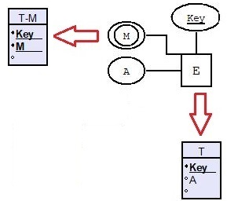
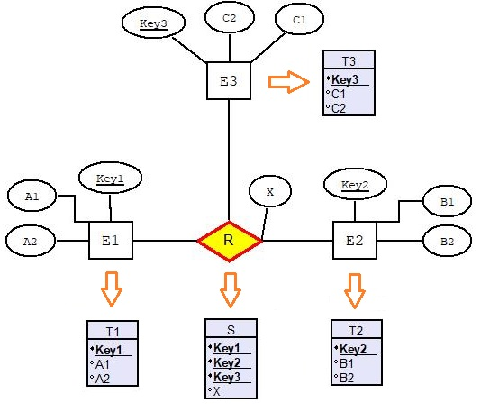
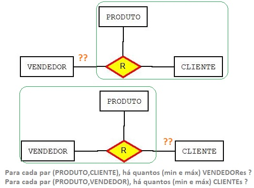

## [Tópico T37] - Mapeamento MER para MR (parte 3)
###### *by Prof. Plinio Sa Leitao-Junior (INF/UFG)*

O conteúdo apresentado usa o esquema conceitual do **BD Empresa**, conforme abaixo.

### Regra 06 - Mapeamento de Atributo Multivalorado

Para cada atributo multivalorado **_M_**, pertencente ao tipo de entidade **E**:
- O tipo de entidade **E** é mapeado pela relação **T**:
  - a chave primária de **T** é **_Key_**;
  - a atributo **_M_** não deve ser incluído em **T**.
- Para mapear o atributo multivalorado multivalorado **_M_** em **E**:
  - criar uma nova relação **T\_M**;
  - incluir em **T\_M**:
    - um atributo correspondente ao próprio atributo multivalorado **_M_**;
    - um atributo correspondente à chave estrangeira, denominado **_Key_**, a qual referencia a chave primária da relação **T**;
  - a chave primária de **T\_M** é composta por:
    - o atributo **_Key_**; e
    - o atributo **_M_**.

Sobre o BD Empresa, a aplicação desta regra resulta em (_realce em **negrito**_):

|Esquema de relação|
|-|
|FUNCIONARIO (Pnome, Minicial, Unome, Cpf, Datanasc, Endereco, Sexo, Salario, Cpf_supervisor, Dnr) FUNCIONARIO (Cpf) IS PRIMARY KEY FUNCIONARIO (Cpf_supervisor) REFERENCES FUNCIONARIO (Cpf) FUNCIONARIO (Dnr) REFERENCES DEPARTAMENTO (Dnumero)|
|DEPARTAMENTO (Dnome, Dnumero, Cpf_gerente, Data_inicio_gerente) DEPARTAMENTO (Dnumero) IS PRIMARY KEY DEPARTAMENTO (Cpf_gerente) REFERENCES FUNCIONARIO (Cpf)|
|PROJETO (Projnome, Projnumero, Projlocal, Dnum) PROJETO (Projnumero) IS PRIMARY KEY PROJETO (Dnum) REFERENCES DEPARTAMENTO (Dnumero)|
|DEPENDENTE (Fcpf, Nome_dependente, Sexo, Datanasc, Parentesco) DEPENDENTE (Fcpf, Nome_dependente) IS PRIMARY KEY DEPENDENTE (Fcpf) REFERENCES FUNCIONARIO (Cpf)|
|TRABALHA_EM (Fcpf, Pnr, Horas) TRABALHA_EM (Fcpf, Pnr) IS PRIMARY KEY TRABALHA_EM (Fcpf) REFERENCES FUNCIONARIO (Cpf) TRABALHA_EM (Pnr) REFERENCES PROJETO (Projnumero)|
|**LOCALIZACAO_DEP (Dnumero, Dlocal) LOCALIZACAO_DEP (Dnumero, Dlocal) IS PRIMARY KEY LOCALIZACAO_DEP (Dnumero) REFERENCES DEPARTAMENTO (Dnumero)**|

### Regra 07 - Mapeamento de Tipo de Relacionamento N-ário

Seja o tipo de relacionamento n-ário R (**n > 2**) no esquema conceitual (esquema ER), conforme a figura abaixo:
- **E1**, **E2** e **E3** são os tipos de entidade que participam de **R**.
- **T1**, **T2** e **T3** correspondem às relações mapeadas a partir de **E1**, **E2** e **E3**, respectivamente.

Para cada tipo de relacionamento n-ário **R**, tal que **n > 2**, criar uma nova relação **S** para representar R:
- Incluir em **S** as chaves estrangeiras que referenciam as chaves primárias das relações que representam os tipos de entidades participantes:
  - incluir **Key1** que referencia **T1**;
  - incluir **Key2** que referencia **T2**;
  - incluir **Key3** que referencia **T3**.
- A chave primária de **S** é, em geral, uma combinação de todas as chaves estrangeiras que fazem referência às relações que representam os tipos de entidade participantes:
  - **S1 (Key1, Key2, Key3) IS PRIMARY KEY**
    - entretanto, se as restrições de cardinalidade em qualquer um dos tipos de entidade **Ei** (que participam de **R**) for 1, a chave primária de **S** não precisa incluir o atributo de chave estrangeira que faz referência à relação **Ti**.
- Incluir na relação **S** todos os atributos simples (ou componentes simples de atributos compostos) do tipo de relacionamento **R**.

A aplicação desta regra ao esquema da figura acima resulta em (_realce em **negrito**_):

|Esquema de relação|
|-|
|**T1 (Key1, A1, A2) T1 (Key1) IS PRIMARY KEY**|
|**T2 (Key2, B1, B2) T2 (Key2) IS PRIMARY KEY**|
|**T3 (Key3, C1, C2) T3 (Key3) IS PRIMARY KEY**|
|**S (Key1, Key2, Key3, X) S (Key1, Key2, Key3) IS PRIMARY KEY S (Key1) REFERENCES T1 (Key1) S (Key2) REFERENCES T2 (Key2) S (Key3) REFERENCES T3 (Key3)**|

> Como determinar a restrição de cardinalidade (e a restrição de participação) em tipos de relacionamento n-ário, tal que **n > 2**?

