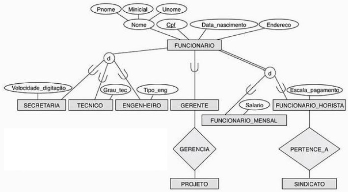
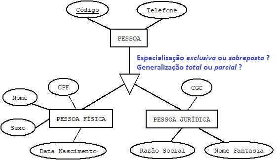

## [Tópico T38] - Mapeamento MER para MR (parte 4)
###### *by Prof. Plinio Sa Leitao-Junior (INF/UFG)*

> Motivação: Qual o esquema lógico pertinente ao DER abaixo:

### Regra 08 - Mapeamento de Especialização/Generalização

Para ilustrar, considere o esquema conceitual (DER) do **BD simples**, mostrado a seguir.

Como mapear cada hierarquia de generalização/especialização? 
Abstratamente, considere que:
- **SUPER** é a superclasse que possui **n+1** atributos - **{k, a1, ..., an}** - tal que **k** é o atributo chave;
- Há **m** subclasses **{SUB1, SUB2, ..., SUBm}**.

#### OPÇÃO 1: Relações múltiplas - superclasse e subclasses

- Alternativa adequada para **qualquer generalização** (total ou parcial) e **qualquer especialização** (disjunta ou sobreposta).
- Criar uma relação **R_SUPER** para a superclasse **SUPER**:
  - com os atributos **Attrs(R_SUPER) = {k, a1,…, an}**; e
  - **PK(R_SUPER) = k**.
- Criar uma relação **R_SUBi** para cada subclasse **SUBi**, **1 ≤ i ≤ m**:
  - os atributos **Attrs(R_SUBi) = {k} ∪ {atributos de SUBi}**;
  - **PK(R_SUBi) = k**.

Sobre o **BD Simples**, a aplicação desta opção resulta em:

|Esquema de relação|
|-|
|PESSOA (CodPes, Fone) PESSOA (CodPes) IS PRIMARY KEY|
|PESSOAJURIDICA (CodPes, CGC, RazaoSocial) PESSOAJURIDICA (CodPes) IS PRIMARY KEY PESSOAJURIDICA (CodPes) REFERENCES PESSOA (CodPes)|
|PESSOAFISICA (CodPes, CPF, Nome, DataNasc, Sexo) PESSOAFISICA (CodPes) IS PRIMARY KEY PESSOAFISICA (CodPes) REFERENCES PESSOA (CodPes)|

#### OPÇÃO 2: Relações múltiplas - restrito a subclasses

- Alternativa adequada para **generalização total** e **especialização exclusiva**:
  - se a especialização se sobrepõe, a mesma entidade pode ser duplicada em várias relações.
- Criar uma relação **R_SUBi** para cada subclasse **SUBi**, **1 ≤ i ≤ m**:
  - os atributos **Attrs(R_SUBi) = {k, a1,…, an} ∪ {atributos de SUBi}**;
  - **PK(R_SUBi) = k**.

Sobre o **BD Simples**, a aplicação desta opção resulta em:

|Esquema de relação|
|-|
|PESSOAJURIDICA (CodPes, Fone, CGC, RazaoSocial) PESSOAJURIDICA (CodPes) IS PRIMARY KEY|
|PESSOAFISICA (CodPes, Fone, CPF, Nome, DataNasc, Sexo) PESSOAFISICA (CodPes) IS PRIMARY KEY|

#### OPÇÃO 3: Relação única, com um atributo de tipo de especialização

- Alternativa adequada para **especialização exclusiva**:
  - pode haver elevado número de valores nulos, se há muitos atributos específicos nas subclasses.
- Criar uma única relação **R_SUPER** para ambas, a superclasse e todas as subclasses **SUBi**, **1 ≤ i ≤ m**:
  - os atributos **Attrs(R_SUPER) = {k, a1,…, an} ∪ {atributos de SUB1} ∪ {atributos de SUB2} ∪ ... ∪ {atributos de SUBm} ∪ {t}**;
  - o atributo **t** é chamado **atributo de tipo** (ou _atributo discriminante_), cujo valor indica a subclasse à qual cada _tupla_ pertence, se houver;
  - **PK(R_SUPER) = k**.

Sobre o **BD Simples**, a aplicação desta opção resulta em:

|Esquema de relação|
|-|
|PESSOA (CodPes, **Tipo**, Fone, CGC, RazaoSocial, CPF, Nome, DataNasc, Sexo) PESSOA (CodPes) IS PRIMARY KEY|

#### OPÇÃO 4: Relação única, com multiplos atributos de tipo de especialização

- Alternativa adequada para especialização cujas subclasses estão sobrepostas.
- Criar uma única relação **R_SUPER** para ambas, a superclasse e todas as subclasses **SUBi**, **1 ≤ i ≤ m**:
  - os atributos **Attrs(R_SUPER) = {k, a1,…, an} ∪ {atributos de SUB1} ∪ {atributos de SUB2} ∪ ... ∪ {atributos de SUBm} ∪ {t1, t2,…, tm}**;
  - Cada **ti**, **1 ≤ i ≤ m**, é um atributo do tipo booleano que indica se uma _tupla_ pertence ou não à subclasse **SUBi**.
  - **PK(R_SUPER) = k**.

Sobre o **BD Simples**, a aplicação desta opção resulta em:

|Esquema de relação|
|-|
|PESSOA (CodPes, **Tipo_pessoa_fisica**, **Tipo_pessoa_juridica**, Fone, CGC, RazaoSocial, CPF, Nome, DataNasc, Sexo) PESSOA (CodPes) IS PRIMARY KEY|
